# Schema Reorganisation: Postgres Schemas + Profile-Anchored FK Structure

> **Goals:**
> 1. Organise all tables into named PostgreSQL schemas by domain.
> 2. Drop the redundant NestJS `users` table — `public.user` (Better Auth) is the single source of truth.
> 3. Profile tables (`client.profile`, `expert.profile`, `agent.profile`) anchor directly to `public.user.id` via a real FK (same DB).
> 4. All domain tables FK to the relevant profile table — never directly to `public.user`.
> 5. Cross-role tables use nullable role-specific FK columns (a user can hold multiple roles).
> 6. Referrals tracked in `public.referral` linking profiles to profiles.
> 7. All table names are singular.
>
> **No backfilling. No backward compatibility shims. Clean schema only.**

---

## PostgreSQL Schema Layout

| Schema | Tables | Purpose |
|--------|--------|---------|
| `public` | `user` *(Better Auth — do not modify)*, `address`, `notification`, `referral`, `festival`, `quote`, `calendar_cache`, `place_cache`, `place_image_cache` | Shared / cross-cutting tables |
| `auth` | `session`, `account`, `verification`, `organization`, `member`, `invitation` | Better Auth session data — do not modify |
| `client` | `profile`, `cart`, `cart_item`, `order`, `order_item`, `wishlist`, `client_coupon`, `payment_order` | Client identity + client-owned data |
| `expert` | `profile`, `puja`, `bank_account`, `todo`, `withdrawal` | Expert identity + expert-owned data |
| `agent` | `profile`, `listing` | Agent identity + agent-owned data |
| `consultation` | `chat_session`, `chat_message`, `call_session`, `review`, `puja_appointment` | Core service interactions |
| `finance` | `wallet`, `transaction` | Wallet and transaction ledger |
| `support` | `dispute`, `dispute_message` | Customer support |
| `commerce` | `product`, `coupon` | Product catalogue and coupons |
| `admin` | `audit_log` | Admin audit trail |

---

## Architecture

```
public.user  (id TEXT PK)  ← Better Auth, source of truth
     │
     │ better_auth_user_id TEXT  (real FK — same DB)
     ├──────────────────┬──────────────────────────┐
     ▼                  ▼                          ▼
client.profile     expert.profile           agent.profile
 (int PK)           (int PK)                 (int PK)
     │                   │                        │
     ▼                   ▼                        ▼
client.*           expert.*                 agent.*
consultation.*     consultation.*           consultation.*
finance.*          finance.*                support.*
support.*          support.*
commerce.*
```

Profile tables keep **integer PKs** — all downstream FK joins stay cheap ints. The only TEXT FK is the single profile → `public.user` boundary.

---

## Target Schema Diagram

```mermaid
erDiagram
    public_user["public.user (Better Auth)"] {
        text id PK
        text email
        text name
        text role
        boolean banned
    }

    public_referral["public.referral"] {
        int id PK
        int referrer_client_id FK
        int referrer_expert_id FK
        int referrer_agent_id FK
        int referee_client_id FK
        int referee_expert_id FK
        int referee_agent_id FK
    }

    public_address["public.address"] {
        int id PK
        int client_id FK
        int expert_id FK
    }

    public_notification["public.notification"] {
        int id PK
        int client_id FK
        int expert_id FK
        int agent_id FK
        text admin_id FK
    }

    client_profile["client.profile"] {
        int id PK
        text better_auth_user_id FK
    }

    expert_profile["expert.profile"] {
        int id PK
        text better_auth_user_id FK
    }

    agent_profile["agent.profile"] {
        int id PK
        text better_auth_user_id FK
    }

    expert_puja["expert.puja"] {
        int id PK
        int expert_id FK
    }

    expert_bank_account["expert.bank_account"] {
        int id PK
        int expert_id FK
    }

    expert_todo["expert.todo"] {
        int id PK
        int expert_id FK
    }

    agent_listing["agent.listing"] {
        int id PK
        int agent_id FK
    }

    consultation_chat_session["consultation.chat_session"] {
        int id PK
        int client_id FK
        int expert_id FK
    }

    consultation_call_session["consultation.call_session"] {
        int id PK
        int client_id FK
        int expert_id FK
    }

    consultation_review["consultation.review"] {
        int id PK
        int client_id FK
        int expert_id FK
    }

    consultation_puja_appointment["consultation.puja_appointment"] {
        int id PK
        int client_id FK
        int expert_id FK
        int puja_id FK
    }

    client_cart["client.cart"] {
        int id PK
        int client_id FK
    }

    client_order["client.order"] {
        int id PK
        int client_id FK
    }

    client_wishlist["client.wishlist"] {
        int id PK
        int client_id FK
        int expert_id FK
    }

    client_client_coupon["client.client_coupon"] {
        int id PK
        int client_id FK
        int coupon_id FK
    }

    client_payment_order["client.payment_order"] {
        int id PK
        int client_id FK
    }

    commerce_product["commerce.product"] {
        int id PK
        int expert_id FK
    }

    commerce_coupon["commerce.coupon"] {
        int id PK
    }

    finance_wallet["finance.wallet"] {
        int id PK
        int client_id FK
        int expert_id FK
    }

    finance_transaction["finance.transaction"] {
        int id PK
        int wallet_id FK
    }

    expert_withdrawal["expert.withdrawal"] {
        int id PK
        int expert_id FK
        int bank_account_id FK
    }

    support_dispute["support.dispute"] {
        int id PK
        int client_id FK
        int expert_id FK
        int agent_id FK
    }

    support_dispute_message["support.dispute_message"] {
        int id PK
        int dispute_id FK
        int client_id FK
        int expert_id FK
        int agent_id FK
        text admin_id FK
    }

    admin_audit_log["admin.audit_log"] {
        int id PK
        text admin_id FK
    }

    public_user ||--o{ client_profile : "better_auth_user_id"
    public_user ||--o{ expert_profile : "better_auth_user_id"
    public_user ||--|| agent_profile : "better_auth_user_id"
    public_user ||--o{ public_notification : "admin_id (nullable)"
    public_user ||--o{ support_dispute_message : "admin_id (nullable)"
    public_user ||--o{ admin_audit_log : "admin_id"

    client_profile |o--o{ public_referral : "referrer_client_id"
    expert_profile |o--o{ public_referral : "referrer_expert_id"
    agent_profile  |o--o{ public_referral : "referrer_agent_id"
    client_profile |o--o{ public_referral : "referee_client_id"
    expert_profile |o--o{ public_referral : "referee_expert_id"
    agent_profile  |o--o{ public_referral : "referee_agent_id"

    client_profile ||--o{ public_address : "client_id (nullable)"
    expert_profile ||--o{ public_address : "expert_id (nullable)"

    expert_profile ||--o{ expert_puja : "expert_id"
    expert_profile ||--o{ expert_bank_account : "expert_id"
    expert_profile ||--o{ expert_todo : "expert_id"
    agent_profile  ||--o{ agent_listing : "agent_id"

    client_profile ||--o{ consultation_chat_session : "client_id"
    expert_profile ||--o{ consultation_chat_session : "expert_id"
    client_profile ||--o{ consultation_call_session : "client_id"
    expert_profile ||--o{ consultation_call_session : "expert_id"
    client_profile ||--o{ consultation_review : "client_id"
    expert_profile ||--o{ consultation_review : "expert_id"
    client_profile ||--o{ consultation_puja_appointment : "client_id"
    expert_profile ||--o{ consultation_puja_appointment : "expert_id"
    expert_puja    ||--o{ consultation_puja_appointment : "puja_id"

    client_profile ||--o| client_cart : "client_id"
    client_profile ||--o{ client_order : "client_id"
    client_profile ||--o{ client_wishlist : "client_id"
    expert_profile ||--o{ client_wishlist : "expert_id (nullable)"
    client_profile ||--o{ client_client_coupon : "client_id"
    commerce_coupon ||--o{ client_client_coupon : "coupon_id"
    client_profile ||--o{ client_payment_order : "client_id"
    expert_profile ||--o{ commerce_product : "expert_id (nullable)"

    client_profile ||--o| finance_wallet : "client_id (nullable)"
    expert_profile ||--o| finance_wallet : "expert_id (nullable)"
    finance_wallet ||--o{ finance_transaction : "wallet_id"
    expert_profile ||--o{ expert_withdrawal : "expert_id"
    expert_bank_account ||--o{ expert_withdrawal : "bank_account_id"

    client_profile ||--o{ support_dispute : "client_id (nullable)"
    expert_profile ||--o{ support_dispute : "expert_id (nullable)"
    agent_profile  ||--o{ support_dispute : "agent_id (nullable)"
    support_dispute ||--o{ support_dispute_message : "dispute_id"
    client_profile ||--o{ support_dispute_message : "client_id (nullable)"
    expert_profile ||--o{ support_dispute_message : "expert_id (nullable)"
    agent_profile  ||--o{ support_dispute_message : "agent_id (nullable)"

    client_profile ||--o{ public_notification : "client_id (nullable)"
    expert_profile ||--o{ public_notification : "expert_id (nullable)"
    agent_profile  ||--o{ public_notification : "agent_id (nullable)"
```



---

## Migration Steps

### Step 0 — Create schemas and drop `users`

```sql
CREATE SCHEMA client;
CREATE SCHEMA expert;
CREATE SCHEMA agent;
CREATE SCHEMA consultation;
CREATE SCHEMA finance;
CREATE SCHEMA support;
CREATE SCHEMA commerce;
CREATE SCHEMA admin;

-- Drop all FKs pointing at the NestJS users table, then drop it
DROP TABLE public.users;
```

---

### Step 1 — Anchor profile tables to `public.user`

```sql
-- client.profile  (was public.profile_clients)
ALTER TABLE public.profile_clients
  DROP COLUMN user_id,
  ALTER COLUMN better_auth_user_id SET NOT NULL,
  ADD CONSTRAINT uq_client_profile_ba_user UNIQUE (better_auth_user_id),
  ADD CONSTRAINT fk_client_profile_ba_user
    FOREIGN KEY (better_auth_user_id) REFERENCES public."user"(id) ON DELETE CASCADE;
ALTER TABLE public.profile_clients SET SCHEMA client;
ALTER TABLE client.profile_clients RENAME TO profile;

-- expert.profile  (was public.profile_experts)
ALTER TABLE public.profile_experts
  DROP COLUMN user_id,
  ALTER COLUMN better_auth_user_id SET NOT NULL,
  ADD CONSTRAINT uq_expert_profile_ba_user UNIQUE (better_auth_user_id),
  ADD CONSTRAINT fk_expert_profile_ba_user
    FOREIGN KEY (better_auth_user_id) REFERENCES public."user"(id) ON DELETE CASCADE;
ALTER TABLE public.profile_experts SET SCHEMA expert;
ALTER TABLE expert.profile_experts RENAME TO profile;

-- agent.profile  (was public.agent_profiles)
ALTER TABLE public.agent_profiles
  DROP COLUMN user_id,
  ALTER COLUMN better_auth_user_id SET NOT NULL,
  ADD CONSTRAINT uq_agent_profile_ba_user UNIQUE (better_auth_user_id),
  ADD CONSTRAINT fk_agent_profile_ba_user
    FOREIGN KEY (better_auth_user_id) REFERENCES public."user"(id) ON DELETE CASCADE;
ALTER TABLE public.agent_profiles SET SCHEMA agent;
ALTER TABLE agent.agent_profiles RENAME TO profile;
```

TypeORM:
```ts
@Entity({ name: 'profile', schema: 'client' })
export class ClientProfile {
  @PrimaryGeneratedColumn() id: number;
  @Column({ unique: true }) better_auth_user_id: string;
  // ... rest of columns
}

@Entity({ name: 'profile', schema: 'expert' })
export class ExpertProfile { ... }

@Entity({ name: 'profile', schema: 'agent' })
export class AgentProfile { ... }
```

---

### Step 2 — `public.referral` (new table)

```sql
CREATE TABLE public.referral (
  id                 SERIAL PRIMARY KEY,
  referrer_client_id INT REFERENCES client.profile(id) ON DELETE SET NULL,
  referrer_expert_id INT REFERENCES expert.profile(id) ON DELETE SET NULL,
  referrer_agent_id  INT REFERENCES agent.profile(id)  ON DELETE SET NULL,
  referee_client_id  INT REFERENCES client.profile(id) ON DELETE CASCADE,
  referee_expert_id  INT REFERENCES expert.profile(id) ON DELETE CASCADE,
  referee_agent_id   INT REFERENCES agent.profile(id)  ON DELETE CASCADE,
  created_at         TIMESTAMPTZ DEFAULT now() NOT NULL,
  CONSTRAINT chk_referral_one_referrer CHECK (
    (referrer_client_id IS NOT NULL)::int +
    (referrer_expert_id IS NOT NULL)::int +
    (referrer_agent_id  IS NOT NULL)::int = 1
  ),
  CONSTRAINT chk_referral_one_referee CHECK (
    (referee_client_id IS NOT NULL)::int +
    (referee_expert_id IS NOT NULL)::int +
    (referee_agent_id  IS NOT NULL)::int = 1
  )
);
```

TypeORM: `@Entity({ name: 'referral', schema: 'public' })`

---

### Step 3 — `public.address` (rename + stay in public)

```sql
ALTER TABLE public.addresses RENAME TO address;
```

TypeORM: `@Entity({ name: 'address', schema: 'public' })`

---

### Step 4 — Expert schema domain tables

```sql
-- expert.puja
ALTER TABLE public.expert_pujas SET SCHEMA expert;
ALTER TABLE expert.expert_pujas RENAME TO puja;

-- expert.bank_account
ALTER TABLE public.expert_bank_accounts SET SCHEMA expert;
ALTER TABLE expert.expert_bank_accounts RENAME TO bank_account;

-- expert.todo
ALTER TABLE public.expert_todos SET SCHEMA expert;
ALTER TABLE expert.expert_todos RENAME TO todo;

-- expert.withdrawal
ALTER TABLE public.withdrawals
  DROP COLUMN user_id,
  ADD COLUMN expert_id INT NOT NULL,
  ADD CONSTRAINT fk_withdrawal_expert
    FOREIGN KEY (expert_id) REFERENCES expert.profile(id),
  ADD CONSTRAINT fk_withdrawal_bank_account
    FOREIGN KEY (bank_account_id) REFERENCES expert.bank_account(id);
ALTER TABLE public.withdrawals SET SCHEMA expert;
ALTER TABLE expert.withdrawals RENAME TO withdrawal;
```

TypeORM:
```ts
@Entity({ name: 'puja', schema: 'expert' })
@Entity({ name: 'bank_account', schema: 'expert' })
@Entity({ name: 'todo', schema: 'expert' })
@Entity({ name: 'withdrawal', schema: 'expert' })
```

---

### Step 5 — Agent schema domain tables

```sql
-- agent.listing
ALTER TABLE public.agent_listings
  DROP COLUMN agent_id,
  ADD COLUMN agent_id INT NOT NULL,
  ADD CONSTRAINT fk_listing_agent
    FOREIGN KEY (agent_id) REFERENCES agent.profile(id);
ALTER TABLE public.agent_listings SET SCHEMA agent;
ALTER TABLE agent.agent_listings RENAME TO listing;
```

TypeORM: `@Entity({ name: 'listing', schema: 'agent' })`

---

### Step 6 — Consultation schema

```sql
-- consultation.chat_session
ALTER TABLE public.chat_sessions
  DROP COLUMN user_id,
  ADD COLUMN client_id INT NOT NULL,
  ADD CONSTRAINT fk_chat_session_client
    FOREIGN KEY (client_id) REFERENCES client.profile(id);
ALTER TABLE public.chat_sessions SET SCHEMA consultation;
ALTER TABLE consultation.chat_sessions RENAME TO chat_session;

-- consultation.chat_message
ALTER TABLE public.chat_messages SET SCHEMA consultation;
ALTER TABLE consultation.chat_messages RENAME TO chat_message;

-- consultation.call_session
ALTER TABLE public.call_sessions
  DROP COLUMN user_id,
  ADD COLUMN client_id INT NOT NULL,
  ADD CONSTRAINT fk_call_session_client
    FOREIGN KEY (client_id) REFERENCES client.profile(id);
ALTER TABLE public.call_sessions SET SCHEMA consultation;
ALTER TABLE consultation.call_sessions RENAME TO call_session;

-- consultation.review
ALTER TABLE public.reviews
  DROP COLUMN user_id,
  ADD COLUMN client_id INT NOT NULL,
  ADD CONSTRAINT fk_review_client
    FOREIGN KEY (client_id) REFERENCES client.profile(id);
ALTER TABLE public.reviews SET SCHEMA consultation;
ALTER TABLE consultation.reviews RENAME TO review;

-- consultation.puja_appointment
ALTER TABLE public.puja_appointments
  DROP COLUMN user_id,
  ADD COLUMN client_id INT NOT NULL,
  ADD CONSTRAINT fk_puja_appt_client
    FOREIGN KEY (client_id) REFERENCES client.profile(id),
  ADD CONSTRAINT fk_puja_appt_puja
    FOREIGN KEY (puja_id) REFERENCES expert.puja(id);
ALTER TABLE public.puja_appointments SET SCHEMA consultation;
ALTER TABLE consultation.puja_appointments RENAME TO puja_appointment;
```

TypeORM:
```ts
@Entity({ name: 'chat_session', schema: 'consultation' })
@Entity({ name: 'chat_message', schema: 'consultation' })
@Entity({ name: 'call_session', schema: 'consultation' })
@Entity({ name: 'review', schema: 'consultation' })
@Entity({ name: 'puja_appointment', schema: 'consultation' })
```

---

### Step 7 — Client schema domain tables

```sql
-- client.cart
ALTER TABLE public.carts
  DROP COLUMN user_id,
  ADD COLUMN client_id INT NOT NULL,
  ADD CONSTRAINT fk_cart_client
    FOREIGN KEY (client_id) REFERENCES client.profile(id);
ALTER TABLE public.carts SET SCHEMA client;
ALTER TABLE client.carts RENAME TO cart;

-- client.cart_item
ALTER TABLE public.cart_items SET SCHEMA client;
ALTER TABLE client.cart_items RENAME TO cart_item;

-- client.order  (was product_orders)
ALTER TABLE public.product_orders
  DROP COLUMN user_id,
  ADD COLUMN client_id INT NOT NULL,
  ADD CONSTRAINT fk_order_client
    FOREIGN KEY (client_id) REFERENCES client.profile(id);
ALTER TABLE public.product_orders SET SCHEMA client;
ALTER TABLE client.product_orders RENAME TO order;

-- client.order_item
ALTER TABLE public.order_items SET SCHEMA client;
ALTER TABLE client.order_items RENAME TO order_item;

-- client.wishlist
ALTER TABLE public.wishlists
  DROP COLUMN user_id,
  ADD COLUMN client_id INT NOT NULL,
  DROP CONSTRAINT IF EXISTS fk_wishlists_expert_user,
  ADD CONSTRAINT fk_wishlist_client
    FOREIGN KEY (client_id) REFERENCES client.profile(id),
  ADD CONSTRAINT fk_wishlist_expert
    FOREIGN KEY (expert_id) REFERENCES expert.profile(id);
ALTER TABLE public.wishlists SET SCHEMA client;
ALTER TABLE client.wishlists RENAME TO wishlist;

-- client.client_coupon  (was user_coupons)
ALTER TABLE public.user_coupons
  DROP COLUMN user_id,
  ADD COLUMN client_id INT NOT NULL,
  ADD CONSTRAINT fk_client_coupon_client
    FOREIGN KEY (client_id) REFERENCES client.profile(id),
  ADD CONSTRAINT fk_client_coupon_coupon
    FOREIGN KEY (coupon_id) REFERENCES commerce.coupon(id);
ALTER TABLE public.user_coupons SET SCHEMA client;
ALTER TABLE client.user_coupons RENAME TO client_coupon;

-- client.payment_order
ALTER TABLE public.payment_orders
  DROP COLUMN user_id,
  ADD COLUMN client_id INT,
  ADD CONSTRAINT fk_payment_order_client
    FOREIGN KEY (client_id) REFERENCES client.profile(id);
ALTER TABLE public.payment_orders SET SCHEMA client;
ALTER TABLE client.payment_orders RENAME TO payment_order;
```

TypeORM:
```ts
@Entity({ name: 'cart', schema: 'client' })
@Entity({ name: 'cart_item', schema: 'client' })
@Entity({ name: 'order', schema: 'client' })
@Entity({ name: 'order_item', schema: 'client' })
@Entity({ name: 'wishlist', schema: 'client' })
@Entity({ name: 'client_coupon', schema: 'client' })
@Entity({ name: 'payment_order', schema: 'client' })
```

---

### Step 8 — Commerce schema

```sql
-- commerce.product
ALTER TABLE public.products
  ADD CONSTRAINT fk_product_expert
    FOREIGN KEY (expert_id) REFERENCES expert.profile(id);
ALTER TABLE public.products SET SCHEMA commerce;
ALTER TABLE commerce.products RENAME TO product;

-- commerce.coupon
ALTER TABLE public.coupons SET SCHEMA commerce;
ALTER TABLE commerce.coupons RENAME TO coupon;
```

TypeORM:
```ts
@Entity({ name: 'product', schema: 'commerce' })
@Entity({ name: 'coupon', schema: 'commerce' })
```

---

### Step 9 — Finance schema

```sql
-- finance.wallet
ALTER TABLE public.wallets
  DROP COLUMN user_id,
  ADD COLUMN client_id INT,
  ADD COLUMN expert_id INT,
  ADD CONSTRAINT fk_wallet_client
    FOREIGN KEY (client_id) REFERENCES client.profile(id),
  ADD CONSTRAINT fk_wallet_expert
    FOREIGN KEY (expert_id) REFERENCES expert.profile(id),
  ADD CONSTRAINT chk_wallet_one_owner CHECK (
    (client_id IS NOT NULL AND expert_id IS NULL) OR
    (client_id IS NULL     AND expert_id IS NOT NULL)
  );
ALTER TABLE public.wallets SET SCHEMA finance;
ALTER TABLE finance.wallets RENAME TO wallet;

-- finance.transaction
ALTER TABLE public.transactions SET SCHEMA finance;
ALTER TABLE finance.transactions RENAME TO transaction;
```

TypeORM:
```ts
@Entity({ name: 'wallet', schema: 'finance' })
@Entity({ name: 'transaction', schema: 'finance' })
```

---

### Step 10 — Support schema

```sql
-- support.dispute  (was support_disputes)
ALTER TABLE public.support_disputes
  DROP COLUMN user_id,
  ADD COLUMN client_id INT,
  ADD COLUMN expert_id INT,
  ADD COLUMN agent_id  INT,
  ADD CONSTRAINT fk_dispute_client FOREIGN KEY (client_id) REFERENCES client.profile(id),
  ADD CONSTRAINT fk_dispute_expert FOREIGN KEY (expert_id) REFERENCES expert.profile(id),
  ADD CONSTRAINT fk_dispute_agent  FOREIGN KEY (agent_id)  REFERENCES agent.profile(id);
ALTER TABLE public.support_disputes SET SCHEMA support;
ALTER TABLE support.support_disputes RENAME TO dispute;

-- support.dispute_message  (was support_dispute_messages)
ALTER TABLE public.support_dispute_messages
  DROP COLUMN sender_id,
  ADD COLUMN client_id INT,
  ADD COLUMN expert_id INT,
  ADD COLUMN agent_id  INT,
  ADD COLUMN admin_id  TEXT,
  ADD CONSTRAINT fk_dispute_msg_client FOREIGN KEY (client_id) REFERENCES client.profile(id),
  ADD CONSTRAINT fk_dispute_msg_expert FOREIGN KEY (expert_id) REFERENCES expert.profile(id),
  ADD CONSTRAINT fk_dispute_msg_agent  FOREIGN KEY (agent_id)  REFERENCES agent.profile(id),
  ADD CONSTRAINT fk_dispute_msg_admin  FOREIGN KEY (admin_id)  REFERENCES public."user"(id);
ALTER TABLE public.support_dispute_messages SET SCHEMA support;
ALTER TABLE support.support_dispute_messages RENAME TO dispute_message;
```

TypeORM:
```ts
@Entity({ name: 'dispute', schema: 'support' })
@Entity({ name: 'dispute_message', schema: 'support' })
```

---

### Step 11 — Notification (stay in public, rename)

```sql
ALTER TABLE public.notifications
  DROP COLUMN user_id,
  ADD COLUMN client_id INT,
  ADD COLUMN expert_id INT,
  ADD COLUMN agent_id  INT,
  ADD COLUMN admin_id  TEXT,
  ADD CONSTRAINT fk_notification_client FOREIGN KEY (client_id) REFERENCES client.profile(id),
  ADD CONSTRAINT fk_notification_expert FOREIGN KEY (expert_id) REFERENCES expert.profile(id),
  ADD CONSTRAINT fk_notification_agent  FOREIGN KEY (agent_id)  REFERENCES agent.profile(id),
  ADD CONSTRAINT fk_notification_admin  FOREIGN KEY (admin_id)  REFERENCES public."user"(id);
ALTER TABLE public.notifications RENAME TO notification;
```

TypeORM: `@Entity({ name: 'notification', schema: 'public' })`

---

### Step 12 — Admin schema

```sql
ALTER TABLE public.admin_audit_logs
  DROP COLUMN admin_id,
  ADD COLUMN admin_id TEXT NOT NULL,
  ADD CONSTRAINT fk_audit_log_admin
    FOREIGN KEY (admin_id) REFERENCES public."user"(id);
ALTER TABLE public.admin_audit_logs SET SCHEMA admin;
ALTER TABLE admin.admin_audit_logs RENAME TO audit_log;
```

TypeORM: `@Entity({ name: 'audit_log', schema: 'admin' })`

---

### Step 13 — Content tables (rename, stay in public)

```sql
ALTER TABLE public.calendar_cache      RENAME TO calendar_cache;   -- no change
ALTER TABLE public.places_cache        RENAME TO place_cache;
ALTER TABLE public.place_images_cache  RENAME TO place_image_cache;
-- festivals and quotes are already singular-compatible names; rename if desired:
-- ALTER TABLE public.festivals RENAME TO festival;
-- ALTER TABLE public.quotes    RENAME TO quote;
```

TypeORM:
```ts
@Entity({ name: 'festival', schema: 'public' })
@Entity({ name: 'quote', schema: 'public' })
@Entity({ name: 'calendar_cache', schema: 'public' })
@Entity({ name: 'place_cache', schema: 'public' })
@Entity({ name: 'place_image_cache', schema: 'public' })
```

---

### Step 14 — Grant schema privileges

```sql
GRANT USAGE ON SCHEMA client, expert, agent, consultation,
                       finance, support, commerce, admin
  TO <db_user>;

GRANT ALL ON ALL TABLES    IN SCHEMA client, expert, agent, consultation,
                                      finance, support, commerce, admin
  TO <db_user>;

GRANT ALL ON ALL SEQUENCES IN SCHEMA client, expert, agent, consultation,
                                      finance, support, commerce, admin
  TO <db_user>;
```

---

## Complete Table Inventory

| New qualified name | Old name | Change |
|-------------------|----------|--------|
| `public.user` | `public.user` (Better Auth) | no change |
| `public.address` | `public.addresses` | renamed |
| `public.notification` | `public.notifications` | renamed + FK changed |
| `public.referral` | _(new)_ | new table |
| `public.festival` | `public.festivals` | renamed |
| `public.quote` | `public.quotes` | renamed |
| `public.calendar_cache` | `public.calendar_cache` | no change |
| `public.place_cache` | `public.places_cache` | renamed |
| `public.place_image_cache` | `public.place_images_cache` | renamed |
| `auth.session` | `auth.session` | no change |
| `auth.account` | `auth.account` | no change |
| `auth.verification` | `auth.verification` | no change |
| `client.profile` | `public.profile_clients` | moved + renamed + FK changed |
| `client.cart` | `public.carts` | moved + renamed + FK changed |
| `client.cart_item` | `public.cart_items` | moved + renamed |
| `client.order` | `public.product_orders` | moved + renamed + FK changed |
| `client.order_item` | `public.order_items` | moved + renamed |
| `client.wishlist` | `public.wishlists` | moved + renamed + FKs fixed |
| `client.client_coupon` | `public.user_coupons` | moved + renamed + FK changed |
| `client.payment_order` | `public.payment_orders` | moved + renamed + FK changed |
| `expert.profile` | `public.profile_experts` | moved + renamed + FK changed |
| `expert.puja` | `public.expert_pujas` | moved + renamed |
| `expert.bank_account` | `public.expert_bank_accounts` | moved + renamed |
| `expert.todo` | `public.expert_todos` | moved + renamed |
| `expert.withdrawal` | `public.withdrawals` | moved + renamed + FK changed |
| `agent.profile` | `public.agent_profiles` | moved + renamed + FK changed |
| `agent.listing` | `public.agent_listings` | moved + renamed + FK changed |
| `consultation.chat_session` | `public.chat_sessions` | moved + renamed + FK changed |
| `consultation.chat_message` | `public.chat_messages` | moved + renamed |
| `consultation.call_session` | `public.call_sessions` | moved + renamed + FK changed |
| `consultation.review` | `public.reviews` | moved + renamed + FK changed |
| `consultation.puja_appointment` | `public.puja_appointments` | moved + renamed + FK changed |
| `commerce.product` | `public.products` | moved + renamed + FK added |
| `commerce.coupon` | `public.coupons` | moved + renamed |
| `finance.wallet` | `public.wallets` | moved + renamed + FK split |
| `finance.transaction` | `public.transactions` | moved + renamed |
| `support.dispute` | `public.support_disputes` | moved + renamed + FK changed |
| `support.dispute_message` | `public.support_dispute_messages` | moved + renamed + FK changed |
| `admin.audit_log` | `public.admin_audit_logs` | moved + renamed + FK changed |
| _(dropped)_ | `public.users` | dropped |

---

## Verification Checklist

- [ ] `pnpm run build` — zero TS errors
- [ ] `pnpm run test` + `pnpm run test:e2e` pass
- [ ] `\dn` in psql — schemas present: `client`, `expert`, `agent`, `consultation`, `finance`, `support`, `commerce`, `admin`
- [ ] `public.users` no longer exists
- [ ] `\d client.profile` — `user_id` gone, `better_auth_user_id` has UNIQUE + FK to `public.user`
- [ ] `\d finance.wallet` — `client_id` + `expert_id` present, CHECK constraint visible
- [ ] `\d public.referral` — both CHECK constraints present
- [ ] `\d admin.audit_log` — `admin_id` is TEXT with FK to `public.user`
- [ ] Create a client chat session → `consultation.chat_session.client_id` populated
- [ ] Expert requests withdrawal → `expert.withdrawal.expert_id` populated
- [ ] Admin action → `admin.audit_log.admin_id` (text UUID) populated
