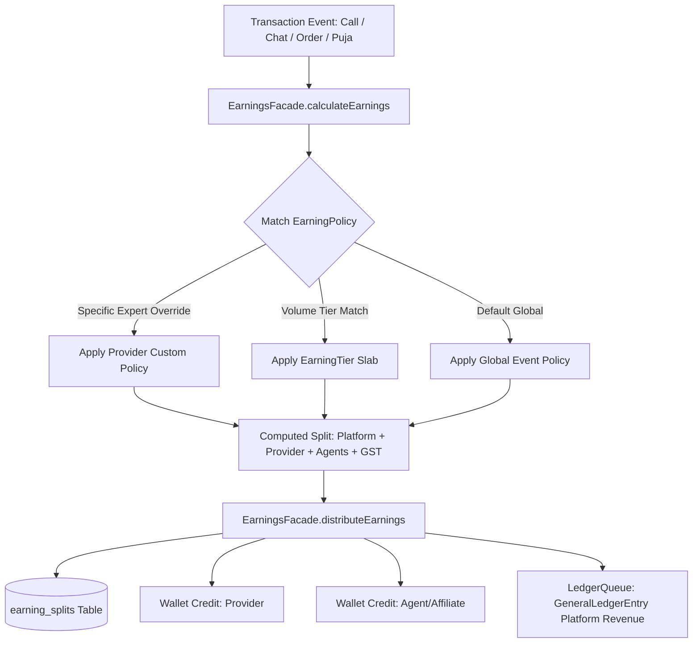
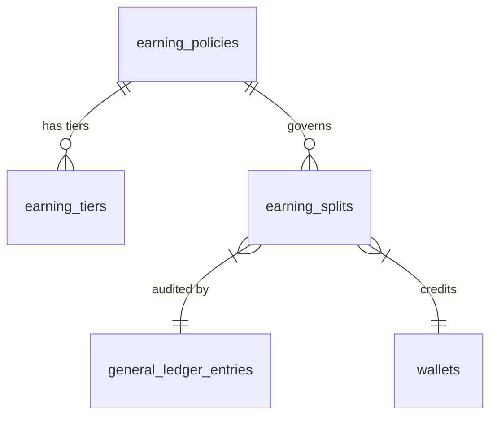

# Unified Earnings & Revenue Distribution Architecture

## 1. Executive Summary & Overview

The **Unified Earnings Module** (`src/modules/finance/earnings/`) serves as the central revenue engine for **Astrology in Bharat**. It unifies and replaces the previously fragmented `commissions` and `platform-earnings` tables into a coherent, policy-driven financial subsystem.

Whether a transaction originates from an **Astrology Consultation (Call/Chat)**, a **Puja / Ritual Booking**, an **E-Commerce Order**, or an **Affiliate Referral Bounty**, the unified earnings engine guarantees accurate mathematical fee splitting, ledger compliance, tax tracking, and automated wallet credits.



---

## 2. Core Entities & Data Model

### 2.1 Entity Relationship Diagram



### 2.2 Table Schemas

#### 1. `earning_policies`
Stores commission and fee rules configured by Admin or assigned per provider.

| Column | Type | Nullable | Description |
| :--- | :--- | :--- | :--- |
| `id` | `UUID` | No | Primary Key |
| `name` | `VARCHAR(120)` | No | Friendly policy name (e.g. "Default Call Policy") |
| `event_type` | `ENUM` | No | `CALL`, `CHAT`, `PUJA`, `PRODUCT_ORDER`, `USER_SIGNUP` |
| `platform_cut_type` | `ENUM` | No | `FIXED` (flat rupee/unit) or `PERCENTAGE` (%) |
| `platform_cut_value` | `DECIMAL(10,2)` | No | Rate value (e.g. ₹2.00/min or 10.00%) |
| `gst_rate_percent` | `DECIMAL(5,2)` | No | GST percentage on platform fee (default 18.00%) |
| `seller_agent_rate` | `DECIMAL(5,2)` | No | Affiliate cut for bringing seller/expert (%) |
| `buyer_agent_rate` | `DECIMAL(5,2)` | No | Affiliate cut for bringing customer (%) |
| `referral_reward_amount` | `DECIMAL(10,2)` | No | Flat signup bounty (e.g. ₹50.00) |
| `min_amount` | `DECIMAL(10,2)` | Yes | Minimum gross transaction value |
| `max_cap` | `DECIMAL(10,2)` | Yes | Maximum platform cut cap |
| `priority` | `INT` | No | Rule priority (higher numbers match first) |
| `applies_to_user_id` | `INT` | Yes | Specific user/expert ID override |
| `is_active` | `BOOLEAN` | No | Active toggle |
| `effective_from` | `TIMESTAMP` | No | Valid starting date |
| `effective_to` | `TIMESTAMP` | Yes | Expiry date |

#### 2. `earning_tiers`
Defines slab-based incentives and reduced platform cut for high-volume transactions.

| Column | Type | Description |
| :--- | :--- | :--- |
| `id` | `UUID` | Primary Key |
| `policy_id` | `UUID` | Foreign key referencing `earning_policies.id` |
| `min_threshold` | `DECIMAL(10,2)` | Minimum amount for slab |
| `max_threshold` | `DECIMAL(10,2)` | Maximum amount (null for unbounded) |
| `platform_rate` | `DECIMAL(10,2)` | Platform rate for this slab |

#### 3. `earning_splits`
Immutable audit log recording exact split breakdown for every transaction.

| Column | Type | Description |
| :--- | :--- | :--- |
| `id` | `UUID` | Primary Key |
| `reference_id` | `VARCHAR(120)` | `call_123`, `chat_456`, `order_789`, `puja_101` |
| `reference_type` | `ENUM` | `CALL`, `CHAT`, `PUJA`, `PRODUCT_ORDER`, `USER_SIGNUP` |
| `gross_amount` | `DECIMAL(10,2)` | Total customer charge |
| `platform_earning` | `DECIMAL(10,2)` | Platform revenue |
| `gst_on_platform_fee` | `DECIMAL(10,2)` | Embedded GST component |
| `provider_earning` | `DECIMAL(10,2)` | Net credited to Expert/Merchant/Priest |
| `seller_agent_earning` | `DECIMAL(10,2)` | Affiliate share for onboarded provider |
| `buyer_agent_earning` | `DECIMAL(10,2)` | Affiliate share for customer |
| `referral_earning` | `DECIMAL(10,2)` | One-time referral bounty |
| `client_profile_id` | `INT` | Client ID |
| `provider_profile_id` | `INT` | Expert / Merchant / Priest profile ID |
| `seller_agent_profile_id` | `INT` | Agent profile ID |
| `policy_id` | `UUID` | Policy ID used for calculation |
| `created_at` | `TIMESTAMP` | Timestamp |

---

## 3. Real-World Business Scenarios & Calculations

### Scenario 1: Astrologer Call / Chat Consultation (Per-Minute Platform Cut)

**Business Model**:
- Astrologers list their consultation fee inclusive of platform charges (e.g., ₹24/minute).
- Platform fee is configured as a fixed ₹2/minute cut.
- GST (18%) is embedded within the platform revenue.

#### Math Walkthrough:
1. Astrologer rate: ₹24.00 / minute.
2. Call duration: 10 minutes (600 seconds).
3. **Gross Transaction Value**: `10 min * ₹24.00 = ₹240.00`
4. **Platform Earning**: `10 min * ₹2.00 = ₹20.00`
   - Platform Base: `₹20.00 / 1.18 = ₹16.95`
   - GST on Platform Cut: `₹20.00 - ₹16.95 = ₹3.05`
5. **Astrologer Net Earning**: `₹240.00 - ₹20.00 = ₹220.00`
6. **Wallet Transactions**:
   - Client Wallet: Debited ₹240.00
   - Expert Wallet: Credited ₹220.00
   - General Ledger: Platform Revenue credited ₹20.00

```json
{
  "referenceId": "call_9876",
  "grossAmount": 240.00,
  "platformEarning": 20.00,
  "gstOnPlatformFee": 3.05,
  "providerEarning": 220.00,
  "sellerAgentEarning": 0.00,
  "buyerAgentEarning": 0.00
}
```

---

### Scenario 2: Consultation with Affiliate / Agent Referral Commission

**Business Model**:
- The Astrologer was onboarded by Agent A (Seller Agent, 2% commission).
- The Client was referred by Agent B (Buyer Agent, 1% commission).
- Call duration: 15 minutes at ₹30/minute.

#### Math Walkthrough:
1. **Gross Transaction Value**: `15 min * ₹30.00 = ₹450.00`
2. **Platform Cut (₹3/min)**: `15 min * ₹3.00 = ₹45.00`
3. **Seller Agent Commission (2%)**: `₹450.00 * 0.02 = ₹9.00`
4. **Buyer Agent Commission (1%)**: `₹450.00 * 0.01 = ₹4.50`
5. **Astrologer Net Earning**: `₹450.00 - (₹45.00 + ₹9.00 + ₹4.50) = ₹391.50`
6. **Wallet Disbursements**:
   - Astrologer Wallet: Credited ₹391.50
   - Agent A (Seller Agent): Credited ₹9.00
   - Agent B (Buyer Agent): Credited ₹4.50
   - Platform Revenue Ledger: Credited ₹45.00

---

### Scenario 3: E-Commerce Product Order (Multi-Vendor Marketplace Take-Rate)

**Business Model**:
- Customer purchases a Brass Idol from a verified Merchant for ₹2,000.
- Platform Policy for `PRODUCT_ORDER`: 10% Marketplace Take-Rate (`PERCENTAGE`).
- Buyer Platform Convenience Fee: ₹5.00.

#### Math Walkthrough:
1. Product Item Total: ₹2,000.00
2. Platform Convenience Fee: ₹5.00
3. **Total Customer Paid**: ₹2,005.00
4. **Platform Earning**: `(₹2,000 * 10%) + ₹5.00 = ₹205.00`
   - GST on Platform Take: `(₹205.00 * 18) / 118 = ₹31.27`
5. **Merchant Net Earning**: `₹2,000.00 - ₹200.00 = ₹1,800.00`
6. **Settlement Trigger**:
   - Earning is split upon order placement, but Merchant Wallet credit is executed upon successful shipment delivery & OTP verification (`VerifyOrderOtpUseCase`).

---

### Scenario 4: Puja / Ritual Booking (Priest & Temple Fulfillment)

**Business Model**:
- Customer books a Maha Mrityunjaya Jaap for ₹5,100.
- Platform Policy for `PUJA`: 15% Platform Commission.

#### Math Walkthrough:
1. **Gross Booking Amount**: ₹5,100.00
2. **Platform Earning (15%)**: `₹5,100.00 * 0.15 = ₹765.00`
3. **Priest / Temple Net Earning**: `₹5,100.00 - ₹765.00 = ₹4,335.00`
4. **Ledger Actions**:
   - Priest Wallet Credited ₹4,335.00 upon status change to `CONFIRMED` / `COMPLETED`.
   - General Ledger Platform Credit: ₹765.00.

---

### Scenario 5: High-Volume Tiered Astrologer Slab Incentive

**Business Model**:
- Premium Astrologer conducts large monthly volume.
- Tier 1: ₹0 – ₹10,000 gross -> Platform cut = ₹3.00/min
- Tier 2: ₹10,001 – ₹50,000 gross -> Platform cut = ₹2.00/min
- Tier 3: > ₹50,000 gross -> Platform cut = ₹1.00/min

#### Math Walkthrough:
- When the astrologer reaches Tier 3, a 10-minute consultation (at ₹50/min, ₹500 gross) only incurs `10 * ₹1.00 = ₹10.00` platform cut.
- Astrologer receives `₹490.00` (98% net retention), automatically incentivizing top performers.

---

### Scenario 6: Cancellation & Pro-Rata Handling

1. **Short Consultation / Premature Hang-Up**:
   - Customer terminates a ₹24/min call after 90 seconds (1.5 minutes).
   - Cost calculated per second: `90 * (24 / 60) = ₹36.00`.
   - Platform cut (fixed ₹2/min): `1.5 * ₹2.00 = ₹3.00`.
   - Astrologer net: `₹33.00`.
   - Unused pre-authorized wallet hold (e.g. ₹120 reserved - ₹36 used = ₹84) is instantly released back to client's available balance.

2. **Order Cancellation Before Dispatch**:
   - Full refund initiated via `OrderRefund` entity.
   - Financial ledger entries are reversed (reversal debit to platform revenue, refund credit to client wallet/gateway).

---

## 4. API Endpoints & Administration

The `EarningsController` exposes administrative controls at `/api/v1/admin/finance/earnings`:

### 4.1 Create Earning Policy
```http
POST /api/v1/admin/finance/earnings/policies
Authorization: Bearer <ADMIN_JWT>
Content-Type: application/json

{
  "name": "Standard Astrology Chat & Call Policy",
  "eventType": "CALL",
  "platformCutType": "FIXED",
  "platformCutValue": 2.00,
  "gstRatePercent": 18.00,
  "sellerAgentRate": 0.02,
  "buyerAgentRate": 0.01,
  "priority": 10,
  "isActive": true
}
```

### 4.2 Calculation Preview Simulator
```http
POST /api/v1/admin/finance/earnings/calculate-preview
Authorization: Bearer <ADMIN_JWT>
Content-Type: application/json

{
  "eventType": "CALL",
  "grossAmount": 240.00,
  "durationMinutes": 10,
  "providerProfileId": 42
}
```

### 4.3 Get Earnings Summary & Reports
```http
GET /api/v1/admin/finance/earnings/summary?from=2026-09-01&to=2026-09-30&eventType=CALL
Authorization: Bearer <ADMIN_JWT>
```

**Response**:
```json
{
  "totalGross": 1540000.00,
  "totalPlatformEarnings": 128333.00,
  "totalProviderEarnings": 1380000.00,
  "totalAgentCommissions": 31667.00,
  "totalTransactions": 6420
}
```

---

## 5. Developer Integration Guide

### Injecting `EarningsFacade` in Service Modules:

```typescript
import { Injectable } from '@nestjs/common';
import { EarningsFacade } from '@/modules/finance/earnings/earnings.facade';
import { EarningEventType } from '@/modules/finance/earnings/enums';

@Injectable()
export class OrderFulfillmentService {
  constructor(private readonly earningsFacade: EarningsFacade) {}

  async finalizeOrderPayout(order: Order, qr?: QueryRunner) {
    const split = await this.earningsFacade.distributeEarnings({
      referenceId: order.order_number,
      eventType: EarningEventType.PRODUCT_ORDER,
      grossAmount: Number(order.total_amount),
      providerProfileId: order.merchant_id,
      clientProfileId: order.client_id,
    }, qr);

    return split;
  }
}
```

---

## 6. Summary of Architectural Advantages

1. **Single Source of Financial Truth**: No conflicting commission rules or fragmented ledgers.
2. **Granular Multi-Party Revenue Sharing**: Supports Platform + Provider + Seller Agent + Buyer Agent + Tax in a single transaction.
3. **High Extensibility**: Adding new services (e.g. Courses, Workshops, Horoscope Reports) only requires adding a new `EarningEventType` enum value and policy.
4. **Audit Trail**: Every rupee disbursed is linked directly to an immutable `earning_splits` record and verified against `general_ledger_entries`.
