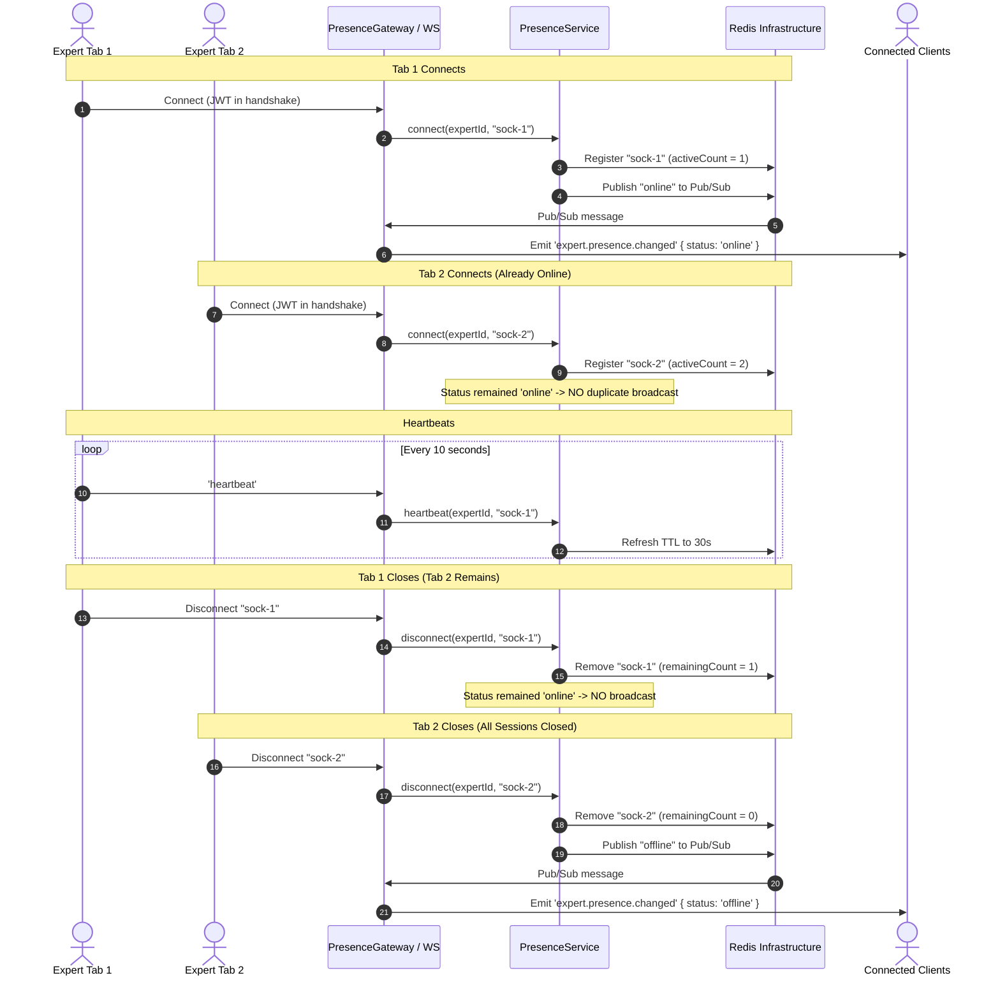

# Expert Realtime Presence & Consultation Availability System

## 1. Overview & Objectives

This document details the architecture, domain model, Redis infrastructure, WebSocket event lifecycle, and API contracts for the **Expert Realtime Presence and Consultation Availability System** in the Astrology in Bharat platform.

The system computes and broadcasts the client-facing status of experts (`online`, `busy`, `offline`) in real-time across horizontally scaled NestJS instances.

---

## 2. Domain Model: Three Independent States

The client-facing status is derived from three decoupled, independent pieces of state:

```
┌─────────────────────────────────────────────────────────────┐
│ 1. Realtime Presence (Ephemeral - Redis)                    │
│    "Is the expert's application/device connected?"          │
│    Values: 'online' | 'offline'                             │
├─────────────────────────────────────────────────────────────┤
│ 2. Availability Mode (Persistent - PostgreSQL)              │
│    "Does the expert want to receive new consultations?"     │
│    Values: 'available' | 'unavailable'                      │
├─────────────────────────────────────────────────────────────┤
│ 3. Consultation State (Authoritative - Consultation Domain) │
│    "Is the expert currently occupied in a session?"         │
│    Values: 'idle' | 'busy'                                  │
└─────────────────────────────────────────────────────────────┘
                              │
                              ▼
┌─────────────────────────────────────────────────────────────┐
│ Client-Facing Derived Status: 'online' | 'busy' | 'offline' │
└─────────────────────────────────────────────────────────────┘
```

### State Definitions

1. **Realtime Presence (`'online' | 'offline'`):**
   - Derived purely from active WebSocket connectivity and server-side heartbeat tracking.
   - Stored ephemerally in Redis. Never persisted in PostgreSQL.
2. **Availability Mode (`'available' | 'unavailable'`):**
   - Persistent preference toggled by the expert in their dashboard.
   - Stored in PostgreSQL (`expert.account.availability_mode`). Survives Redis restarts, server restarts, and tab disconnects.
3. **Consultation State (`'idle' | 'busy'`):**
   - Authoritative business state managed by chat and call consultation lifecycles.
   - Experts cannot manually mark themselves `busy`. Toggling availability while in an active consultation does not cancel the consultation.

---

## 3. Authoritative Status Derivation

All marketplace listings, detail queries, and WebSocket broadcasts derive client status through a single authoritative function ([`deriveExpertClientStatus`](file:///home/rgstartup/AIB/project/backend/src/internal/presence/presence.utils.ts#L26-L39)):

| Realtime Presence | Availability Mode | Consultation State | Derived Client Status | `isAvailableForConsultation` |
| :---------------- | :---------------- | :----------------- | :-------------------- | :--------------------------- |
| `offline`         | `available`       | `idle`             | `offline`             | `false`                      |
| `offline`         | `available`       | `busy`             | `offline`             | `false`                      |
| `offline`         | `unavailable`     | `idle`             | `offline`             | `false`                      |
| `offline`         | `unavailable`     | `busy`             | `offline`             | `false`                      |
| `online`          | `available`       | `idle`             | **`online`**          | **`true`**                   |
| `online`          | `available`       | `busy`             | **`busy`**            | `false`                      |
| `online`          | `unavailable`     | `idle`             | `offline`             | `false`                      |
| `online`          | `unavailable`     | `busy`             | `offline`             | `false`                      |

**Rules:**

- `offline` realtime presence always results in `offline`.
- `unavailable` manual mode always shows as `offline` to clients in the marketplace.
- `busy` applies only when the expert is connected (`online`) and manually `available`.
- An expert is `online` (and available for booking) **only** when `online` + `available` + `idle`.

---

## 4. Redis Architecture & Ephemeral Keys

Redis serves as the distributed source of truth for ephemeral presence.

### Key Schema

| Key Format                                | Type            | TTL                  | Description                                                                    |
| :---------------------------------------- | :-------------- | :------------------- | :----------------------------------------------------------------------------- |
| `presence:expert:{expertId}:connections`  | Set             | 60s (refreshed)      | Set of active socket `connectionId`s for the expert                            |
| `presence:connection:{connectionId}`      | String (JSON)   | 30s (`PRESENCE_TTL`) | Ephemeral connection metadata (`{ expertId, connectionId, lastSeen }`)         |
| `presence:expert:{expertId}:consultation` | String (JSON)   | None                 | Active consultation state (`{ state: 'busy', consultationId }`)                |
| `presence:expert:{expertId}:availability` | String          | None                 | Fast cache of PostgreSQL `availability_mode`                                   |
| `presence:expert:{expertId}:last_status`  | String          | None                 | Last emitted status (`online` \| `busy` \| `offline`) for change deduplication |
| `presence:events`                         | Pub/Sub Channel | N/A                  | Distributed cross-instance status change events                                |

### Heartbeats & Stale Connection Eviction

- **Heartbeat Interval:** 10 seconds (`PRESENCE_HEARTBEAT_INTERVAL`).
- **Connection TTL:** 30 seconds (`PRESENCE_TTL`).
- If an expert device crashes, loses network, or sleeps, no disconnect event is fired.
- After 30 seconds without a heartbeat, `presence:connection:{connectionId}` expires automatically in Redis.
- Atomic Lua scripts purge expired connection IDs from the expert's connection set during any query or mutation, preventing zombie online states.

### Atomic Lua Scripts & Race Conditions

To prevent race conditions across concurrent connects, disconnects, and heartbeats on multiple instances:

- **`REGISTER_CONNECTION_LUA`**: Atomically validates active connections, purges stale keys, stores connection metadata with TTL, adds socket to the expert set, and returns prior vs. new active count.
- **`HEARTBEAT_LUA`**: Atomically refreshes the connection TTL and expert set expiry.
- **`DISCONNECT_LUA`**: Atomically removes the connection key and set member, purges stale connections, and returns the remaining connection count.
- **`BATCH_REALTIME_PRESENCE_LUA`**: Batch queries and cleans connection sets for N experts in a single Redis round-trip (eliminating N+1 queries).

---

## 5. Multi-Connection Lifecycle

Experts can connect from multiple devices or tabs (e.g. mobile app + desktop browser):



---

## 6. HTTP API & WebSocket Specifications

### HTTP Endpoints

#### 1. Update Expert Availability Mode

- **Endpoint:** `PATCH /api/v1/expert/availability` (or `PATCH /api/v1/expert/account/availability`)
- **Guard:** `ExpertJwtAuthGuard`
- **Request Body:**
  ```json
  {
    "mode": "available" // or "unavailable"
  }
  ```
- **Response:**
  ```json
  {
    "message": "Availability updated successfully",
    "expertId": 42,
    "mode": "available",
    "status": "online",
    "isAvailableForConsultation": true
  }
  ```

#### 2. Get Authenticated Expert Availability State

- **Endpoint:** `GET /api/v1/expert/availability/me`
- **Guard:** `ExpertJwtAuthGuard`
- **Response:**
  ```json
  {
    "expertId": 42,
    "realtimePresence": "online",
    "availabilityMode": "available",
    "consultationState": "idle",
    "status": "online",
    "isAvailableForConsultation": true,
    "activeConnections": 1
  }
  ```

#### 3. Public Expert Presence Lookup

- **Endpoint:** `GET /api/v1/expert/presence/:id`
- **Access:** Public
- **Response:**
  ```json
  {
    "expertId": 42,
    "status": "online",
    "isAvailableForConsultation": true
  }
  ```

#### 4. Expert Listings

- **Endpoints:** `GET /api/v1/expert/account/list`, `GET /api/v1/expert/account/top-rated`, `GET /api/v1/expert/account/:id`
- **Response Shape:** Every expert record includes:
  ```json
  {
    "id": 42,
    "name": "Acharya Sharma",
    "status": "online",
    "isAvailableForConsultation": true
  }
  ```

---

### WebSocket Events

#### Client Handshake & Authentication

Pass token in `auth.token`, `headers.authorization`, or `query.token`:

```js
const socket = io('https://api.example.com', {
  auth: { token: '<EXPERT_JWT_ACCESS_TOKEN>' },
});
```

#### Client-Facing Broadcast Event

- **Event Name:** `expert.presence.changed`
- **Payload:**
  ```json
  {
    "expertId": 42,
    "status": "busy",
    "timestamp": "2026-10-01T10:00:00.000Z"
  }
  ```

#### Expert Heartbeat Event

- **Emit:** `socket.emit('heartbeat')`
- **Ack Response:**
  ```json
  {
    "status": "ok",
    "timestamp": 1759312000000
  }
  ```

#### Specific Expert Subscription

- **Emit:** `socket.emit('subscribe_expert_presence', { expertId: 42 })`
- **Ack Response:**
  ```json
  {
    "expertId": 42,
    "status": "online"
  }
  ```

---

## 7. Automated Test Suite

Test suite location: [`src/internal/presence/tests/`](file:///home/rgstartup/AIB/project/backend/src/internal/presence/tests/):

1. **[`presence.utils.spec.ts`](file:///home/rgstartup/AIB/project/backend/src/internal/presence/tests/presence.utils.spec.ts)**: Unit tests for all 8 status derivation combinations and consultation availability booleans.
2. **[`presence.service.spec.ts`](file:///home/rgstartup/AIB/project/backend/src/internal/presence/tests/presence.service.spec.ts)**: Unit tests for multi-tab lifecycle, heartbeat TTL handling, manual availability changes, consultation transitions, race conditions, and batched pipeline query efficiency (avoiding N+1).
3. **[`presence.gateway.spec.ts`](file:///home/rgstartup/AIB/project/backend/src/internal/presence/tests/presence.gateway.spec.ts)**: Gateway tests for handshake JWT authentication, heartbeat dispatch, disconnect handling, and room broadcasting.
4. **[`presence.e2e.spec.ts`](file:///home/rgstartup/AIB/project/backend/src/internal/presence/tests/presence.e2e.spec.ts)**: End-to-end simulation covering the entire expert lifecycle:
   - Connect (`online`) → Unavailable (`offline`) → Available (`online`) → Consultation Start (`busy`) → Consultation End (`online`) → Disconnect (`offline`).
