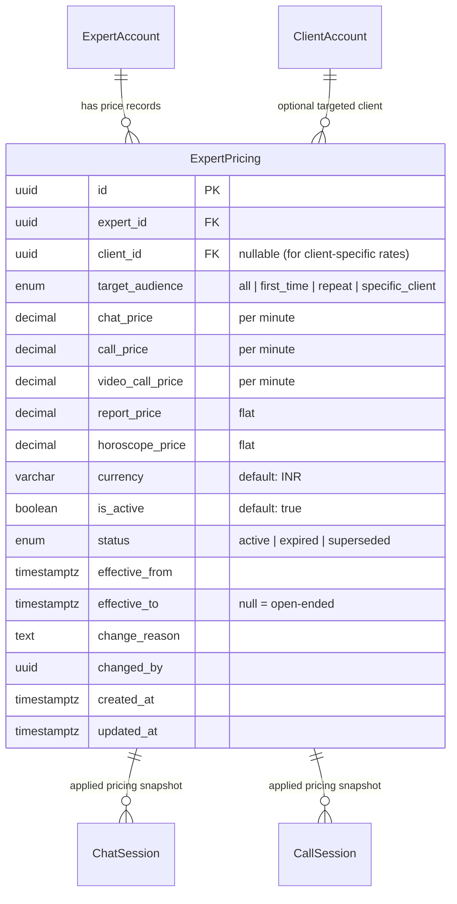
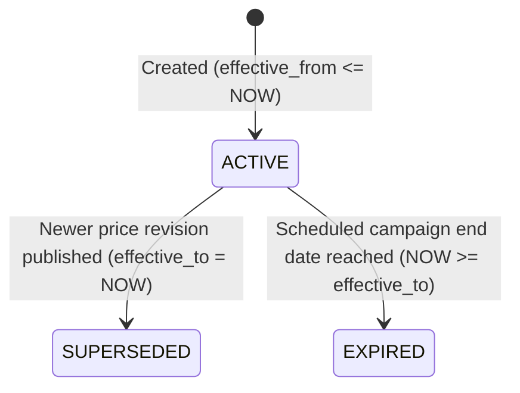

# Expert Pricing & Versioned History Architecture

## 1. Overview & Objectives

In the Astrology in Bharat platform, astrologers and experts may revise their rates over time (e.g., increasing per-minute chat rates from ₹20 to ₹35). Furthermore, platforms require dynamic pricing capabilities such as:
- **First-time introductory consultation rates** (e.g., promotional ₹1/min or free trial for new clients).
- **Targeted or negotiated rates** (e.g., custom price locked for a specific VIP client).
- **Audit integrity & historical immutability**: Previous consultations, invoices, and financial payouts must permanently reference the exact rate applicable at the time of the consultation, unaffected by subsequent price revisions.

---

## 2. Database Schema & Entity Structure

The pricing system is modeled under the PostgreSQL schema `expert` in table `expert_pricing`.

### 2.1 Entity Relationship Diagram



---

## 3. Enums & Status Transitions

### 3.1 `PricingTargetAudience`
- **`all`**: Base standard rate for all users.
- **`first_time`**: Introductory promotional rate for a client's first session with this expert.
- **`repeat`**: Special rate for returning clients.
- **`specific_client`**: Custom locked rate applicable strictly to a single `client_id`.

### 3.2 `PricingStatus` Lifecycle



- **`ACTIVE`**: The current in-effect price.
- **`SUPERSEDED`**: Replaced early by a newer price revision (old record is closed with `effective_to = NOW()` and `is_active = false`).
- **`EXPIRED`**: Terminated automatically because its preset promotional end date was reached.

---

## 4. Price Resolution Algorithm (Waterfall Priority)

When a client initiates a consultation (e.g. Chat or Call), the system calculates the effective price using a prioritized waterfall:

```
Step 1: Check for active Client-Specific Override
        (target_audience = 'specific_client' AND client_id = :clientId)
        ↓ [If none found]
Step 2: Check for First-Time User Offer
        (target_audience = 'first_time' AND client has 0 completed sessions with expert)
        ↓ [If none found]
Step 3: Base Standard Rate
        (target_audience = 'all')
```

### SQL Resolution Query:
```sql
SELECT *
FROM expert.expert_pricing
WHERE expert_id = :expertId
  AND is_active = true
  AND status = 'active'
  AND effective_from <= NOW()
  AND (effective_to IS NULL OR effective_to > NOW())
  AND (
    (target_audience = 'specific_client' AND client_id = :clientId)
    OR (target_audience = 'first_time' AND :isFirstTime = true)
    OR (target_audience = 'all')
  )
ORDER BY 
  CASE target_audience
    WHEN 'specific_client' THEN 1
    WHEN 'first_time' THEN 2
    ELSE 3
  END ASC
LIMIT 1;
```

---

## 5. Price Revision Workflow Example

When an expert or admin updates consultation rates:

1. **Find current active base price**:
   ```sql
   SELECT * FROM expert.expert_pricing
   WHERE expert_id = :expertId AND target_audience = 'all' AND status = 'active';
   ```
2. **Supersede existing record**:
   - Set `effective_to = NOW()`
   - Set `status = 'superseded'`
   - Set `is_active = false`
3. **Insert new versioned price record**:
   - Set `effective_from = NOW()`
   - Set `effective_to = NULL`
   - Set `status = 'active'`
   - Set `is_active = true`
   - Record `change_reason` and `changed_by`

---

## 6. Consultation & Financial Snapshotting

When a session starts:
- The session entity (`ChatSession` / `CallSession` / `ConsultationOrder`) records:
  - `pricing_id`: Foreign key pointing to the exact `ExpertPricing` row.
  - `rate_per_minute`: Snapshot of the rate at the start of the session.
- This guarantees financial consistency and invoice accuracy even if the astrologer modifies rates during or after the session.
