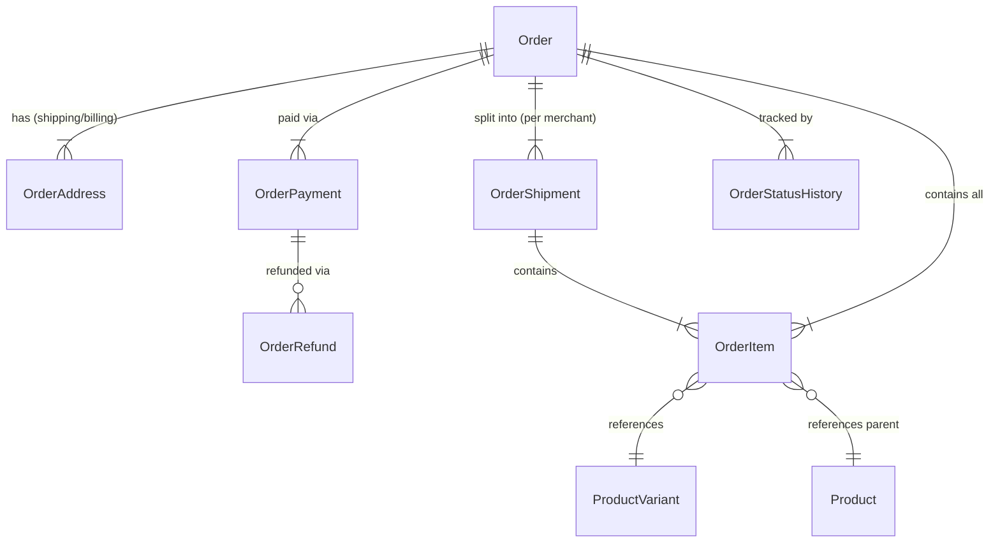

# Order Module Architecture & Entity Redesign Specification

This document details the analysis of the existing commerce entities (specifically the modernized **Products & Variants** domain) and provides a comprehensive design specification for upgrading the **Order Module** entities in **Astrology in Bharat**.

---

## 1. Executive Summary & Context

The Commerce domain is transitioning from legacy monolithic records to a normalized, variant-centric architecture:

- **Products Domain**: Has been modularized into `Product`, `ProductVariant`, `ProductInventory`, `ProductVariantPricing`, `ProductVariantPromotions`, `ProductFulFillment`, and `ProductMedia`.
- **Order Domain (Current State)**: Still references legacy product columns (`product_id`), stores volatile references without immutable snapshotting, relies on unstructured `json` addresses, and lacks first-class support for multi-vendor fulfillment (sub-orders), split payments, and structured lifecycle audits.

This specification defines the modernized entity model, data integrity rules, multi-vendor fulfillment mechanics, payment tracking, and migration roadmap.

---

## 2. Product Domain Entity Matrix (Reference)

```
[Product] (Parent Catalog Container)
   │
   ├── [ProductCategory] (ManyToMany)
   │
   └── [ProductVariant] (Purchasable SKU / Atomic Unit)
         │
         ├── [ProductFulFillment] (Fulfillment Type, Delivery Type, Shipping SLA)
         ├── [ProductInventory]   (Physical stock, Reserved stock)
         ├── [ProductVariantPricing] (Audience, Currency, Validity Period)
         ├── [ProductVariantPromotions] (Discounts, Rule Validity)
         └── [ProductMedia]       (Images, Videos, Media Roles)
```

### Key Considerations for Orders:
1. **Atomic Unit of Sale**: Carts and Orders must reference `ProductVariant` instead of the top-level `Product`.
2. **Pricing & Promotions Snapshot**: The price at purchase time is resolved from `ProductVariantPricing` + `ProductVariantPromotions` and must be frozen immutably onto the order item.
3. **Fulfillment Metadata**: Shipping SLAs, courier weights, and delivery fees come from `ProductFulFillment`.

---

## 3. Current Order Gaps vs. Desired Architecture

| Domain Dimension | Current Implementation | Target Redesign |
| :--- | :--- | :--- |
| **Catalog Reference** | `OrderItem.product_id` -> `Product` | `OrderItem.variant_id` -> `ProductVariant` (with fallback `product_id`) |
| **Data Immutability** | Joins live product data dynamically | Freezes snapshot: title, variant name, SKU, thumbnail, attributes, unit MRP, unit selling price, tax rate |
| **Multi-Vendor Fulfillment** | In-memory grouping in use cases; single order status | Dedicated `OrderShipment` (Sub-Order) per merchant with independent status, courier, OTP, and tracking |
| **Payment Ledger** | Single string `payment_method` & `razorpay_order_id` | Dedicated `OrderPayment` supporting Multi-Payment, Split Payment (Wallet + Gateway), and Gateway signatures |
| **Refunds & Returns** | String `cancellation_reason` | Structured `OrderRefund` tracking destination (Wallet vs Source), gateway refund IDs, and approval status |
| **Address Snapshot** | Generic `json` on `Order` | Dedicated `OrderAddress` (Shipping & Billing) with strict schema validation |
| **Audit & Timeline** | Generic `jsonb` array on `Order` | `OrderStatusHistory` capturing timestamp, previous/new status, actor ID, and actor role |

---

## 4. Proposed Database Schema Design (`commerce` schema)



---

## 5. Detailed Entity Specifications

### 5.1. `Order` (`commerce.orders` / `commerce.product_orders`)
The top-level root entity representing the customer's purchase transaction and master financial ledger.

```typescript
@Entity({ schema: 'commerce', name: 'orders' })
export class Order {
  @PrimaryGeneratedColumn('bigint')
  id!: string;

  @Column({ name: 'order_number', unique: true, length: 50 })
  order_number!: string; // e.g. "AIB-ORD-202609-00123"

  @Column({ name: 'client_id', type: 'int' })
  client_id!: number;

  @ManyToOne(() => ClientAccount)
  @JoinColumn({ name: 'client_id' })
  client!: ClientAccount;

  @Column({
    type: 'enum',
    enum: OrderStatus,
    default: OrderStatus.PENDING,
  })
  status!: OrderStatus;

  @Column({
    name: 'payment_status',
    type: 'enum',
    enum: PaymentStatus,
    default: PaymentStatus.PENDING,
  })
  payment_status!: PaymentStatus;

  // Financial Ledger Breakdown
  @Column({ name: 'subtotal_amount', type: 'decimal', precision: 12, scale: 2, default: 0 })
  subtotal_amount!: number;

  @Column({ name: 'discount_amount', type: 'decimal', precision: 12, scale: 2, default: 0 })
  discount_amount!: number;

  @Column({ name: 'shipping_amount', type: 'decimal', precision: 12, scale: 2, default: 0 })
  shipping_amount!: number;

  @Column({ name: 'tax_amount', type: 'decimal', precision: 12, scale: 2, default: 0 })
  tax_amount!: number;

  @Column({ name: 'platform_fee', type: 'decimal', precision: 12, scale: 2, default: 0 })
  platform_fee!: number;

  @Column({ name: 'total_amount', type: 'decimal', precision: 12, scale: 2, default: 0 })
  total_amount!: number; // = subtotal - discount + shipping + tax + platform_fee

  @Column({ name: 'coupon_code', type: 'varchar', length: 100, nullable: true })
  coupon_code!: string | null;

  // --- Referral & Commission Attribution (Unique User Referral ID) ---
  @Column({ name: 'referral_code', type: 'varchar', length: 50, nullable: true })
  referral_code!: string | null; // The referral ID of the referring user/expert/merchant

  @Column({ name: 'referrer_id', type: 'int', nullable: true })
  referrer_id!: number | null; // User ID / Profile ID of the referrer

  @Column({ name: 'customer_notes', type: 'text', nullable: true })
  customer_notes!: string | null;

  @Column({ name: 'cancellation_reason', type: 'text', nullable: true })
  cancellation_reason!: string | null;

  // Navigation Relations
  @OneToMany(() => OrderShipment, (shipment) => shipment.order, { cascade: true })
  shipments!: OrderShipment[];

  @OneToMany(() => OrderItem, (item) => item.order, { cascade: true })
  items!: OrderItem[];

  @OneToMany(() => OrderPayment, (payment) => payment.order)
  payments!: OrderPayment[];

  @OneToMany(() => OrderAddress, (address) => address.order, { cascade: true })
  addresses!: OrderAddress[];

  @Column({ name: 'status_history', type: 'jsonb', default: [] })
  status_history!: Array<{
    status: string;
    updated_by: string;
    updated_at: string;
    role: string;
  }>;

  @CreateDateColumn({ name: 'created_at', type: 'timestamptz' })
  created_at!: Date;

  @UpdateDateColumn({ name: 'updated_at', type: 'timestamptz' })
  updated_at!: Date;
}
```

---

### 5.2. `OrderShipment` (`commerce.order_shipments`)
Enables independent lifecycle management per merchant / warehouse fulfillment package.

```typescript
@Entity({ schema: 'commerce', name: 'order_shipments' })
export class OrderShipment {
  @PrimaryGeneratedColumn('bigint')
  id!: string;

  @Column({ name: 'shipment_number', unique: true, length: 60 })
  shipment_number!: string; // e.g. "AIB-ORD-202609-00123-S1"

  @Column({ name: 'order_id', type: 'bigint' })
  order_id!: string;

  @ManyToOne(() => Order, (order) => order.shipments, { onDelete: 'CASCADE' })
  @JoinColumn({ name: 'order_id' })
  order!: Order;

  @Column({ name: 'merchant_id', type: 'int', nullable: true })
  merchant_id!: number | null;

  @Column({
    type: 'enum',
    enum: ShipmentStatus,
    default: ShipmentStatus.PENDING,
  })
  status!: ShipmentStatus;

  @Column({ name: 'subtotal_amount', type: 'decimal', precision: 12, scale: 2, default: 0 })
  subtotal_amount!: number;

  @Column({ name: 'shipping_fee', type: 'decimal', precision: 12, scale: 2, default: 0 })
  shipping_fee!: number;

  // Logistics & Tracking
  @Column({ name: 'courier_partner', type: 'varchar', length: 100, nullable: true })
  courier_partner!: string | null; // e.g. "Delhivery", "Shiprocket", "Blue Dart"

  @Column({ name: 'awb_code', type: 'varchar', length: 100, nullable: true })
  awb_code!: string | null;

  @Column({ name: 'tracking_url', type: 'text', nullable: true })
  tracking_url!: string | null;

  @Column({ name: 'delivery_otp', type: 'varchar', length: 10, nullable: true })
  delivery_otp!: string | null;

  @Column({ name: 'estimated_delivery_date', type: 'timestamptz', nullable: true })
  estimated_delivery_date!: Date | null;

  @Column({ name: 'shipped_at', type: 'timestamptz', nullable: true })
  shipped_at!: Date | null;

  @Column({ name: 'delivered_at', type: 'timestamptz', nullable: true })
  delivered_at!: Date | null;

  @OneToMany(() => OrderItem, (item) => item.shipment)
  items!: OrderItem[];

  @CreateDateColumn({ name: 'created_at', type: 'timestamptz' })
  created_at!: Date;

  @UpdateDateColumn({ name: 'updated_at', type: 'timestamptz' })
  updated_at!: Date;
}
```

---

### 5.3. `OrderItem` (`commerce.order_items`)
Variant-aware, immutable item records capturing complete financial and attribute snapshots.

```typescript
@Entity({ schema: 'commerce', name: 'order_items' })
export class OrderItem {
  @PrimaryGeneratedColumn('bigint')
  id!: string;

  @Column({ name: 'order_id', type: 'bigint' })
  order_id!: string;

  @ManyToOne(() => Order, (order) => order.items, { onDelete: 'CASCADE' })
  @JoinColumn({ name: 'order_id' })
  order!: Order;

  @Column({ name: 'shipment_id', type: 'bigint', nullable: true })
  shipment_id!: string | null;

  @ManyToOne(() => OrderShipment, (shipment) => shipment.items, { onDelete: 'SET NULL' })
  @JoinColumn({ name: 'shipment_id' })
  shipment!: OrderShipment | null;

  @Column({ name: 'product_id', type: 'int', nullable: true })
  product_id!: number | null;

  @ManyToOne(() => Product, { onDelete: 'SET NULL', nullable: true })
  @JoinColumn({ name: 'product_id' })
  product!: Product | null;

  @Column({ name: 'variant_id', type: 'bigint', nullable: true })
  variant_id!: string | null;

  @ManyToOne(() => ProductVariant, { onDelete: 'SET NULL', nullable: true })
  @JoinColumn({ name: 'variant_id' })
  variant!: ProductVariant | null;

  @Column({ name: 'merchant_id', type: 'int', nullable: true })
  merchant_id!: number | null;

  // Immutable Item Snapshots
  @Column({ name: 'product_name', type: 'varchar', length: 255 })
  product_name!: string;

  @Column({ name: 'variant_name', type: 'varchar', length: 150, nullable: true })
  variant_name!: string | null;

  @Column({ name: 'sku', type: 'varchar', length: 100, nullable: true })
  sku!: string | null;

  @Column({ name: 'thumbnail_url', type: 'text', nullable: true })
  thumbnail_url!: string | null;

  @Column({ name: 'variant_attributes', type: 'jsonb', nullable: true })
  variant_attributes!: Record<string, unknown> | null;

  // Financial & Tax Attributes
  @Column({ type: 'int', default: 1 })
  quantity!: number;

  @Column({ name: 'unit_mrp', type: 'decimal', precision: 12, scale: 2 })
  unit_mrp!: number;

  @Column({ name: 'unit_price', type: 'decimal', precision: 12, scale: 2 })
  unit_price!: number;

  @Column({ name: 'discount_amount', type: 'decimal', precision: 12, scale: 2, default: 0 })
  discount_amount!: number;

  @Column({ name: 'tax_amount', type: 'decimal', precision: 12, scale: 2, default: 0 })
  tax_amount!: number;

  @Column({ name: 'tax_rate_percent', type: 'decimal', precision: 5, scale: 2, default: 0 })
  tax_rate_percent!: number;

  @Column({ name: 'hsn_code', type: 'varchar', length: 50, nullable: true })
  hsn_code!: string | null;

  @Column({ name: 'total_amount', type: 'decimal', precision: 12, scale: 2 })
  total_amount!: number;

  @Column({
    type: 'enum',
    enum: OrderItemStatus,
    default: OrderItemStatus.PENDING,
  })
  status!: OrderItemStatus;

  @Column({ name: 'cancellation_reason', type: 'text', nullable: true })
  cancellation_reason!: string | null;

  @CreateDateColumn({ name: 'created_at', type: 'timestamptz' })
  created_at!: Date;
}
```

---

### 5.4. `OrderPayment` (`commerce.order_payments`)
Tracks multi-payment methods, split wallet + gateway transactions, and webhook responses.

```typescript
@Entity({ schema: 'commerce', name: 'order_payments' })
export class OrderPayment {
  @PrimaryGeneratedColumn('bigint')
  id!: string;

  @Column({ name: 'order_id', type: 'bigint' })
  order_id!: string;

  @ManyToOne(() => Order, (order) => order.payments, { onDelete: 'CASCADE' })
  @JoinColumn({ name: 'order_id' })
  order!: Order;

  @Column({ name: 'payment_method', type: 'varchar', length: 50 })
  payment_method!: string; // 'razorpay' | 'wallet' | 'cod'

  @Column({ type: 'decimal', precision: 12, scale: 2 })
  amount!: number;

  @Column({ type: 'varchar', length: 10, default: 'INR' })
  currency!: string;

  @Column({
    type: 'enum',
    enum: PaymentTransactionStatus,
    default: PaymentTransactionStatus.PENDING,
  })
  status!: PaymentTransactionStatus;

  @Column({ name: 'gateway_order_id', type: 'varchar', length: 255, nullable: true })
  gateway_order_id!: string | null;

  @Column({ name: 'gateway_payment_id', type: 'varchar', length: 255, nullable: true })
  gateway_payment_id!: string | null;

  @Column({ name: 'gateway_signature', type: 'text', nullable: true })
  gateway_signature!: string | null;

  @Column({ name: 'wallet_transaction_id', type: 'int', nullable: true })
  wallet_transaction_id!: number | null;

  @Column({ name: 'raw_response', type: 'jsonb', nullable: true })
  raw_response!: Record<string, unknown> | null;

  @CreateDateColumn({ name: 'created_at', type: 'timestamptz' })
  created_at!: Date;
}
```

---

### 5.5. `OrderRefund` (`commerce.order_refunds`)
Auditable ledger for partial/full refunds, cancellations, and returns.

```typescript
@Entity({ schema: 'commerce', name: 'order_refunds' })
export class OrderRefund {
  @PrimaryGeneratedColumn('bigint')
  id!: string;

  @Column({ name: 'order_id', type: 'bigint' })
  order_id!: string;

  @ManyToOne(() => Order, { onDelete: 'CASCADE' })
  @JoinColumn({ name: 'order_id' })
  order!: Order;

  @Column({ name: 'payment_id', type: 'bigint', nullable: true })
  payment_id!: string | null;

  @ManyToOne(() => OrderPayment, { nullable: true })
  @JoinColumn({ name: 'payment_id' })
  payment!: OrderPayment | null;

  @Column({ type: 'decimal', precision: 12, scale: 2 })
  amount!: number;

  @Column({ name: 'refund_reason', type: 'text' })
  refund_reason!: string;

  @Column({
    type: 'enum',
    enum: RefundDestination,
    default: RefundDestination.SOURCE,
  })
  destination!: RefundDestination; // 'wallet' | 'source'

  @Column({ name: 'gateway_refund_id', type: 'varchar', length: 255, nullable: true })
  gateway_refund_id!: string | null;

  @Column({
    type: 'enum',
    enum: RefundStatus,
    default: RefundStatus.PENDING,
  })
  status!: RefundStatus;

  @Column({ name: 'processed_by', type: 'int', nullable: true })
  processed_by!: number | null;

  @CreateDateColumn({ name: 'created_at', type: 'timestamptz' })
  created_at!: Date;
}
```

---

### 5.6. `OrderAddress` (`commerce.order_addresses`)
Structured shipping and billing address snapshots at checkout.

```typescript
@Entity({ schema: 'commerce', name: 'order_addresses' })
export class OrderAddress {
  @PrimaryGeneratedColumn('bigint')
  id!: string;

  @Column({ name: 'order_id', type: 'bigint' })
  order_id!: string;

  @ManyToOne(() => Order, (order) => order.addresses, { onDelete: 'CASCADE' })
  @JoinColumn({ name: 'order_id' })
  order!: Order;

  @Column({
    name: 'address_type',
    type: 'enum',
    enum: AddressType,
    default: AddressType.SHIPPING,
  })
  address_type!: AddressType; // 'shipping' | 'billing'

  @Column({ name: 'full_name', type: 'varchar', length: 150 })
  full_name!: string;

  @Column({ name: 'phone', type: 'varchar', length: 20 })
  phone!: string;

  @Column({ name: 'alternate_phone', type: 'varchar', length: 20, nullable: true })
  alternate_phone!: string | null;

  @Column({ name: 'address_line_1', type: 'varchar', length: 255 })
  address_line_1!: string;

  @Column({ name: 'address_line_2', type: 'varchar', length: 255, nullable: true })
  address_line_2!: string | null;

  @Column({ name: 'landmark', type: 'varchar', length: 255, nullable: true })
  landmark!: string | null;

  @Column({ name: 'city', type: 'varchar', length: 100 })
  city!: string;

  @Column({ name: 'state', type: 'varchar', length: 100 })
  state!: string;

  @Column({ name: 'postal_code', type: 'varchar', length: 20 })
  postal_code!: string;

  @Column({ name: 'country', type: 'varchar', length: 100, default: 'India' })
  country!: string;
}
```

---

### 5.7. `OrderStatusHistory` (`commerce.order_status_history`)
Auditable event log tracking state transitions and actors.

```typescript
@Entity({ schema: 'commerce', name: 'order_status_history' })
export class OrderStatusHistory {
  @PrimaryGeneratedColumn('bigint')
  id!: string;

  @Column({ name: 'order_id', type: 'bigint' })
  order_id!: string;

  @ManyToOne(() => Order, (order) => order.status_history, { onDelete: 'CASCADE' })
  @JoinColumn({ name: 'order_id' })
  order!: Order;

  @Column({ name: 'shipment_id', type: 'bigint', nullable: true })
  shipment_id!: string | null;

  @Column({ name: 'previous_status', type: 'varchar', length: 50, nullable: true })
  previous_status!: string | null;

  @Column({ name: 'new_status', type: 'varchar', length: 50 })
  new_status!: string;

  @Column({ name: 'comment', type: 'text', nullable: true })
  comment!: string | null;

  @Column({ name: 'actor_id', type: 'int', nullable: true })
  actor_id!: number | null;

  @Column({ name: 'actor_role', type: 'varchar', length: 50, default: 'system' })
  actor_role!: string; // 'client' | 'merchant' | 'admin' | 'system'

  @CreateDateColumn({ name: 'created_at', type: 'timestamptz' })
  created_at!: Date;
}
```

---

## 6. Enums Reference

```typescript
export enum OrderStatus {
  PENDING = 'pending',
  PAID = 'paid',
  PROCESSING = 'processing',
  PARTIALLY_SHIPPED = 'partially_shipped',
  SHIPPED = 'shipped',
  DELIVERED = 'delivered',
  CANCELLED = 'cancelled',
  REFUNDED = 'refunded',
}

export enum ShipmentStatus {
  PENDING = 'pending',
  PROCESSING = 'processing',
  READY_FOR_PICKUP = 'ready_for_pickup',
  SHIPPED = 'shipped',
  OUT_FOR_DELIVERY = 'out_for_delivery',
  DELIVERED = 'delivered',
  CANCELLED = 'cancelled',
  RETURN_REQUESTED = 'return_requested',
  RETURNED = 'returned',
}

export enum OrderItemStatus {
  PENDING = 'pending',
  PROCESSING = 'processing',
  PACKED = 'packed',
  SHIPPED = 'shipped',
  DELIVERED = 'delivered',
  CANCELLED = 'cancelled',
  RETURN_REQUESTED = 'return_requested',
  RETURNED = 'returned',
}

export enum PaymentStatus {
  PENDING = 'pending',
  AUTHORIZED = 'authorized',
  PAID = 'paid',
  PARTIALLY_REFUNDED = 'partially_refunded',
  REFUNDED = 'refunded',
  FAILED = 'failed',
}

export enum PaymentTransactionStatus {
  PENDING = 'pending',
  SUCCESS = 'success',
  FAILED = 'failed',
  REFUNDED = 'refunded',
}

export enum RefundDestination {
  WALLET = 'wallet',
  SOURCE = 'source',
}

export enum RefundStatus {
  PENDING = 'pending',
  PROCESSED = 'processed',
  FAILED = 'failed',
}

export enum AddressType {
  SHIPPING = 'shipping',
  BILLING = 'billing',
}
```

---

## 7. Migration & Rollout Strategy

1. **Step 1: Database Migration**
   - Create tables: `order_shipments`, `order_payments`, `order_refunds`, `order_addresses`, `order_status_history`.
   - Alter `order_items` table: Add `variant_id`, `shipment_id`, `product_name`, `variant_name`, `sku`, `unit_mrp`, `unit_price`, `tax_amount`, `variant_attributes`.
   - Alter `product_orders` table: Add `order_number`, `subtotal_amount`, `shipping_amount`, `tax_amount`, `payment_status`.

2. **Step 2: Cart Module Alignment**
   - Update `CartItem` to support `variant_id`.
   - Update cart price calculation to resolve variant pricing and active promotions.

3. **Step 3: Refactor `CreateOrderFromCartUseCase`**
   - Atomically create `Order`, `OrderAddress`, `OrderShipment` (grouped by merchant), and `OrderItem` records.
   - Record `OrderPayment` (wallet debit and/or Razorpay order id).
   - Reserve/decrement stock directly on `ProductInventory` (`variant_id`).

4. **Step 4: Merchant & User Facade Updates**
   - Update merchant order queries to join directly with `OrderShipment` and `OrderItem`.
   - Display shipment tracking IDs and individual delivery OTPs per merchant package.

---

## 8. Financial Domain Alignment: Platform Earnings vs. Referral Commissions

### 8.1. Separation of Responsibilities
To maintain clean domain boundaries and prevent pollution between first-party revenues and third-party payouts:

1. **Platform Earnings (Revenue)**:
   - Tracks first-party money collected by the platform (Fixed platform fees, service take-rates, convenience charges).
   - Handled via `PlatformFeePolicy` (config/targeting) and `PlatformEarningLedger` (transactional log).

2. **User Referral Commissions (Expense / Payout)**:
   - In the initial platform phase, complex link redirection/affiliate tracker systems are avoided in favor of a **Unique User Referral ID** assigned to every Client, Expert, and Merchant.
   - When an order or appointment is placed with a `referral_code` (or `referrer_id`), commissions are attributed directly to the referrer's wallet.

