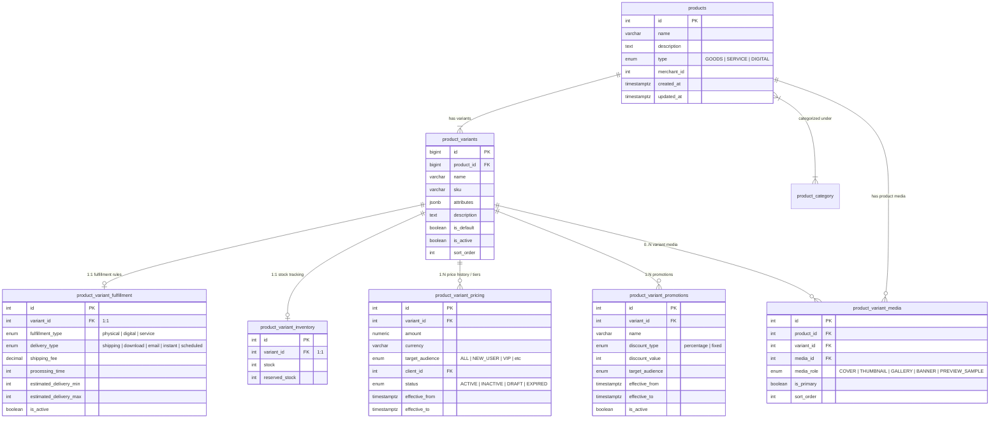

# Product, Variant & Delivery Architecture Documentation

This document outlines the domain schema, entity responsibilities, and fulfillment/delivery mechanics for all product types in **Astrology in Bharat** (Physical Goods, Digital Products, and Astrology/Puja Services).

---

## 1. Overview Matrix

The platform handles products across three core archetypes: **Physical Goods**, **Digital Assets/Reports**, and **Live/Scheduled Services**.

| Variant Name | Product Type (`ProductType`) | Fulfillment Type (`FulfillmentType`) | Delivery Type (`DeliveryType`) | Shipping Fee | Inventory Tracking | Fulfillment Flow |
| :--- | :--- | :--- | :--- | :---: | :---: | :--- |
| **Rudraksha Mala** | `GOODS` | `PHYSICAL` (`physical`) | `SHIPPING` (`shipping`) | ₹50.00 | **Yes** (Warehouse / Merchant Stock) | Physical courier / logistics dispatch to customer address. |
| **Kundli Report** | `DIGITAL` | `DIGITAL` (`digital`) | `EMAIL` (`email`) | ₹0.00 | **No** (Infinite / On-demand generation) | Automated / manual generation, PDF emailed to customer. |
| **Kundli PDF** | `DIGITAL` | `DIGITAL` (`digital`) | `DOWNLOAD` (`download`) | ₹0.00 | **No** (Infinite / Static or dynamic) | Instant secure signed download link provided in app / web. |
| **Satyanarayan Puja** | `SERVICE` | `SERVICE` (`service`) | `SCHEDULED` (`scheduled`) | ₹0.00 | **Slot/Calendar** (Pandit capacity) | Slot booking, sankalp details captured, executed at scheduled time. |
| **Astrology Consultation** | `SERVICE` | `SERVICE` (`service`) | `INSTANT` (`instant`) | ₹0.00 | **Live Presence** (Astrologer online/busy state) | Immediate connection via Agora Audio/Video call or chat session. |

---

## 2. Entity-by-Entity Responsibility Breakdown

The commerce schema is normalized around a **Variant-Centric** modular model under the `commerce` PostgreSQL schema:

```
[Product] (Parent Catalog Container)
   │
   ├── [ProductCategory] (ManyToMany via product_category_relation)
   │
   └── [ProductVariant] (1..N Purchasable Units / SKUs)
         │
         ├── [ProductFulFillment] (1..1: Fulfillment & Delivery Rules)
         ├── [ProductInventory]   (1..1: Stock & Reserved Stock)
         ├── [ProductVariantPricing] (1..N: Time/Audience-based Pricing)
         ├── [ProductVariantPromotions] (1..N: Time/Audience Discounts)
         └── [ProductMedia]       (0..N: Variant-level and Product-level Images/Videos)
```

---

### 2.1. `Product` (`commerce.products`)
* **Role**: The high-level catalog entity. Acts as the parent container for grouping variants, marketing descriptions, category taxonomy, and merchant ownership.
* **Fields**:
  * `id`: `number` (PK)
  * `name`: `string` (e.g., "Rudraksha Collection", "Complete Vedic Kundli", "Personal Astrology Consultation")
  * `type`: `ProductType` (`GOODS`, `SERVICE`, `DIGITAL`)
  * `description`: `text` (Rich HTML/Markdown description)
  * `merchant_id`: `number | null` (Owner/Seller/Vendor ID, if multi-merchant)
  * `categories`: `ProductCategory[]` (ManyToMany relation)
  * `variants`: `ProductVariant[]` (OneToMany relation)
  * `media`: `ProductMedia[]` (OneToMany relation)
* **What belongs here**: Top-level display information common across all sub-variations.

---

### 2.2. `ProductVariant` (`commerce.product_variants`)
* **Role**: The actual atomic purchasable item added to carts, orders, and checkouts. Every product has at least one default variant (`is_default = true`).
* **Fields**:
  * `id`: `bigint` (PK)
  * `product_id`: `bigint` (FK -> `products.id`)
  * `name`: `string` (e.g., "5 Mukhi - Nepal Origin", "50-Page Comprehensive Hindi Report", "15-Min Audio Call")
  * `sku`: `string | null` (Unique SKU code, e.g., `RUD-5M-001`, `KUN-REP-HI-50`)
  * `attributes`: `jsonb` (Key-value specific metadata, e.g., `{"size": "8mm", "beads": 108}` or `{"pages": 50, "language": "hi"}`)
  * `description`: `text | null` (Variant-specific notes or inclusions)
  * `is_default`: `boolean` (Default selected variant on product page)
  * `is_active`: `boolean` (Allows enabling/disabling individual variants)
  * `sort_order`: `number` (Display precedence)
* **What belongs here**: Variant identifiers, dimension/spec attributes, and individual SKU configuration.

---

### 2.3. `ProductFulFillment` (`commerce.product_variant_fulfillment`)
* **Role**: Defines **how** the customer receives the variant once ordered, shipping fees, preparation times, and SLA timelines.
* **Fields**:
  * `id`: `number` (PK)
  * `variant_id`: `number` (OneToOne FK -> `product_variants.id`)
  * `fulfillment_type`: `FulfillmentType` (`PHYSICAL`, `DIGITAL`, `SERVICE`)
  * `delivery_type`: `DeliveryType` (`SHIPPING`, `DOWNLOAD`, `EMAIL`, `INSTANT`, `SCHEDULED`)
  * `shipping_fee`: `decimal(10,2)` (Courier/freight fee, `0.00` for digital/services)
  * `processing_time`: `integer` (Preparation/generation time in minutes or hours)
  * `estimated_delivery_min`: `integer` (Minimum delivery window, e.g., 3 days for shipping)
  * `estimated_delivery_max`: `integer` (Maximum delivery window, e.g., 7 days for shipping)
  * `is_active`: `boolean`
* **What belongs here**: All delivery instructions, logistics rules, SLA bounds, and shipping charge configurations.

---

### 2.4. `ProductInventory` (`commerce.product_variant_inventory`)
* **Role**: Manages stock quantity, safety margins, and temporary checkout holds (reserved stock).
* **Fields**:
  * `id`: `number` (PK)
  * `variant_id`: `number` (OneToOne FK -> `product_variants.id`)
  * `stock`: `number` (Physical units on hand)
  * `reserved_stock`: `number` (Units temporarily locked during pending checkout/payment)
  * `available_stock`: `getter` (`Math.max(0, stock - reserved_stock)`)
* **What belongs here**: Real-time inventory tracking for physical goods. For purely unlimited digital assets or services, inventory rows can either be omitted, set to a high sentinel value, or managed via external booking engines.

---

### 2.5. `ProductVariantPricing` (`commerce.product_variant_pricing`)
* **Role**: Configures dynamic, audience-targeted, and time-bounded pricing for each variant.
* **Fields**:
  * `id`: `number` (PK)
  * `variant_id`: `number` (FK -> `product_variants.id`)
  * `amount`: `numeric(12,2)` (Base selling price, e.g., `1500.00`)
  * `currency`: `varchar(10)` (Default `INR`)
  * `target_audience`: `PricingTargetAudience` (`ALL`, `NEW_USER`, `PREMIUM_USER`, `VIP`, `B2B`, etc.)
  * `client_id`: `number | null` (Specific client-customized pricing override if applicable)
  * `status`: `PricingStatus` (`ACTIVE`, `INACTIVE`, `DRAFT`, `EXPIRED`)
  * `effective_from`: `timestamptz` (When this price starts)
  * `effective_to`: `timestamptz | null` (Price expiration / validity end)
  * `change_reason`: `text | null` (Audit trail log)
  * `changed_by`: `number | null` (Admin / merchant user ID who changed pricing)
* **What belongs here**: Base selling prices, customer segment pricing rules, currency, and pricing history.

---

### 2.6. `ProductVariantPromotions` (`commerce.product_variant_promotions`)
* **Role**: Promotional rules, sales discounts, and festival offers applied on top of base pricing.
* **Fields**:
  * `id`: `number` (PK)
  * `variant_id`: `number` (FK -> `product_variants.id`)
  * `name`: `string` (e.g., "Diwali Special 20% OFF")
  * `discount_type`: `DiscountType` (`PERCENTAGE`, `FIXED`)
  * `discount_value`: `number` (e.g., `20` for 20% or `200` for ₹200 fixed off)
  * `target_audience`: `PricingTargetAudience` (`ALL`, `NEW_USER`, etc.)
  * `effective_from`: `timestamptz`
  * `effective_to`: `timestamptz | null`
  * `is_active`: `boolean`
* **What belongs here**: Timed discount campaigns, slash pricing, coupon-less automatic promotions.

---

### 2.7. `ProductMedia` (`commerce.product_variant_media`)
* **Role**: Associates images, videos, or 3D models from the media repository to a product or a specific variant.
* **Fields**:
  * `id`: `number` (PK)
  * `product_id`: `number` (FK -> `products.id`)
  * `variant_id`: `number | null` (FK -> `product_variants.id`, nullable if product-wide)
  * `media_id`: `number` (FK -> `media.id`)
  * `media_role`: `MediaRole` (`COVER`, `THUMBNAIL`, `GALLERY`, `BANNER`, `PREVIEW_SAMPLE`)
  * `is_primary`: `boolean`
  * `sort_order`: `number`
* **What belongs here**: Visual media linked to general product catalog or color/design-specific variants.

---

## 3. Case-by-Case Storage Guide

### Case 1: Rudraksha Mala (Physical E-Commerce Item)

```mermaid
classDiagram
    direction LR
    class Product {
        name: "Nepali 5 Mukhi Rudraksha Mala"
        type: GOODS
    }
    class ProductVariant {
        name: "108 Beads - 8mm"
        sku: "RUD-5M-108-8MM"
        attributes: {"beads": 108, "size_mm": 8, "origin": "Nepal"}
    }
    class ProductFulFillment {
        fulfillment_type: PHYSICAL
        delivery_type: SHIPPING
        shipping_fee: 50.00
        processing_time: 24 (hours)
        estimated_delivery_min: 3 (days)
        estimated_delivery_max: 7 (days)
    }
    class ProductInventory {
        stock: 50
        reserved_stock: 0
    }
    class ProductVariantPricing {
        amount: 1499.00
        currency: "INR"
    }

    Product --> ProductVariant
    ProductVariant --> ProductFulFillment
    ProductVariant --> ProductInventory
    ProductVariant --> ProductVariantPricing
```

* **Storage Mapping**:
  1. `products`: `name = "Nepali 5 Mukhi Rudraksha Mala"`, `type = ProductType.GOODS`
  2. `product_variants`: `name = "108 Beads - 8mm"`, `sku = "RUD-5M-108-8MM"`, `attributes = {"beads": 108, "size_mm": 8, "origin": "Nepal", "energized": true}`
  3. `product_variant_fulfillment`: `fulfillment_type = FulfillmentType.PHYSICAL`, `delivery_type = DeliveryType.SHIPPING`, `shipping_fee = 50.00`, `processing_time = 24`, `estimated_delivery_min = 3`, `estimated_delivery_max = 7`
  4. `product_variant_inventory`: `stock = 50`, `reserved_stock = 2`
  5. `product_variant_pricing`: `amount = 1499.00`, `currency = "INR"`, `target_audience = ALL`
* **Order & Checkout Behavior**:
  * Requires buyer delivery address, pin code serviceability check.
  * Adds ₹50 shipping fee to the order subtotal.
  * Decrements `stock` upon dispatch, holds `reserved_stock` during checkout.
  * Dispatches via third-party logistics (e.g., Shiprocket, Delhivery) with tracking AWB.

---

### Case 2: Kundli Report (Digital Generated Report via Email)

```mermaid
classDiagram
    direction LR
    class Product {
        name: "Vedic Astrology Life Report"
        type: DIGITAL
    }
    class ProductVariant {
        name: "50-Page Comprehensive Hindi Horoscope"
        sku: "KUN-REP-HI-50"
        attributes: {"pages": 50, "language": "hi", "charts": ["d1", "d9", "d10"]}
    }
    class ProductFulFillment {
        fulfillment_type: DIGITAL
        delivery_type: EMAIL
        shipping_fee: 0.00
        processing_time: 1440 (24 hours SLA)
        estimated_delivery_min: 1
        estimated_delivery_max: 2
    }
    class ProductVariantPricing {
        amount: 499.00
        currency: "INR"
    }

    Product --> ProductVariant
    ProductVariant --> ProductFulFillment
    ProductVariant --> ProductVariantPricing
```

* **Storage Mapping**:
  1. `products`: `name = "Vedic Astrology Life Report"`, `type = ProductType.DIGITAL`
  2. `product_variants`: `name = "50-Page Comprehensive Hindi Horoscope"`, `sku = "KUN-REP-HI-50"`, `attributes = {"pages": 50, "language": "hi", "delivery_channel": "email"}`
  3. `product_variant_fulfillment`: `fulfillment_type = FulfillmentType.DIGITAL`, `delivery_type = DeliveryType.EMAIL`, `shipping_fee = 0.00`, `processing_time = 1440`, `estimated_delivery_min = 1`, `estimated_delivery_max = 2`
  4. `product_variant_inventory`: Not required or stock unlimited.
  5. `product_variant_pricing`: `amount = 499.00`, `currency = "INR"`, `target_audience = ALL`
* **Order & Checkout Behavior**:
  * Requires birth details form (Date of Birth, Time, Place of Birth, Name, Gender, Recipient Email).
  * No shipping address requested.
  * Triggers an asynchronous generation worker/queue job.
  * Sends finalized PDF document via email attachment or secure link upon completion.

---

### Case 3: Kundli PDF (Instant Digital Download)

```mermaid
classDiagram
    direction LR
    class Product {
        name: "Instant 2026 Yearly Planetary Transit PDF"
        type: DIGITAL
    }
    class ProductVariant {
        name: "Aries (Mesha) 2026 Transit Forecast"
        sku: "TRN-2026-ARIES"
        attributes: {"zodiac_sign": "aries", "year": 2026, "file_format": "PDF"}
    }
    class ProductFulFillment {
        fulfillment_type: DIGITAL
        delivery_type: DOWNLOAD
        shipping_fee: 0.00
        processing_time: 0 (Instant)
        estimated_delivery_min: 0
        estimated_delivery_max: 0
    }
    class ProductVariantPricing {
        amount: 199.00
        currency: "INR"
    }

    Product --> ProductVariant
    ProductVariant --> ProductFulFillment
    ProductVariant --> ProductVariantPricing
```

* **Storage Mapping**:
  1. `products`: `name = "Instant 2026 Yearly Planetary Transit PDF"`, `type = ProductType.DIGITAL`
  2. `product_variants`: `name = "Aries (Mesha) 2026 Transit Forecast"`, `sku = "TRN-2026-ARIES"`, `attributes = {"zodiac_sign": "aries", "year": 2026, "file_format": "PDF"}`
  3. `product_variant_fulfillment`: `fulfillment_type = FulfillmentType.DIGITAL`, `delivery_type = DeliveryType.DOWNLOAD`, `shipping_fee = 0.00`, `processing_time = 0`, `estimated_delivery_min = 0`, `estimated_delivery_max = 0`
  4. `product_variant_inventory`: Not required.
  5. `product_variant_pricing`: `amount = 199.00`, `currency = "INR"`, `target_audience = ALL`
* **Order & Checkout Behavior**:
  * No shipping address required.
  * Payment success immediately returns an S3 presigned time-limited secure download URL on the order summary page and order history.

---

### Case 4: Satyanarayan Puja (Service / Scheduled Event)

```mermaid
classDiagram
    direction LR
    class Product {
        name: "Sri Satyanarayan Maha Puja"
        type: SERVICE
    }
    class ProductVariant {
        name: "Online Video Sankalp Puja with Panditji"
        sku: "PUJA-SAT-ONLINE"
        attributes: {"duration_mins": 120, "mode": "video_live", "samagri_provided": true, "pandit_count": 1}
    }
    class ProductFulFillment {
        fulfillment_type: SERVICE
        delivery_type: SCHEDULED
        shipping_fee: 0.00
        processing_time: 0
        estimated_delivery_min: 0
        estimated_delivery_max: 0
    }
    class ProductVariantPricing {
        amount: 2100.00
        currency: "INR"
    }

    Product --> ProductVariant
    ProductVariant --> ProductFulFillment
    ProductVariant --> ProductVariantPricing
```

* **Storage Mapping**:
  1. `products`: `name = "Sri Satyanarayan Maha Puja"`, `type = ProductType.SERVICE`
  2. `product_variants`: `name = "Online Video Sankalp Puja with Panditji"`, `sku = "PUJA-SAT-ONLINE"`, `attributes = {"duration_mins": 120, "mode": "video_live", "samagri_provided": true, "pandit_count": 1}`
  3. `product_variant_fulfillment`: `fulfillment_type = FulfillmentType.SERVICE`, `delivery_type = DeliveryType.SCHEDULED`, `shipping_fee = 0.00`, `processing_time = 0`
  4. `product_variant_inventory`: Tied to Pandit slot availability / booking calendar engine.
  5. `product_variant_pricing`: `amount = 2100.00`, `currency = "INR"`
* **Order & Checkout Behavior**:
  * Requires user to select date & auspicious time slot (Muhurat).
  * Collects Sankalp information (Gotra, Family members' names, Nakshatra, Purpose/Intention).
  * Generates appointment booking with calendar invite and video link.

---

### Case 5: Astrology Consultation (Service / Instant Live Call or Chat)

```mermaid
classDiagram
    direction LR
    class Product {
        name: "Live Astrologer Consultation"
        type: SERVICE
    }
    class ProductVariant {
        name: "15-Min Instant Audio Consultation"
        sku: "CONS-AUD-15M"
        attributes: {"channel": "audio_call", "duration_mins": 15, "call_type": "voip"}
    }
    class ProductFulFillment {
        fulfillment_type: SERVICE
        delivery_type: INSTANT
        shipping_fee: 0.00
        processing_time: 0
        estimated_delivery_min: 0
        estimated_delivery_max: 0
    }
    class ProductVariantPricing {
        amount: 450.00
        currency: "INR"
    }

    Product --> ProductVariant
    ProductVariant --> ProductFulFillment
    ProductVariant --> ProductVariantPricing
```

* **Storage Mapping**:
  1. `products`: `name = "Live Astrologer Consultation"`, `type = ProductType.SERVICE`
  2. `product_variants`: `name = "15-Min Instant Audio Consultation"`, `sku = "CONS-AUD-15M"`, `attributes = {"channel": "audio_call", "duration_mins": 15, "call_type": "voip"}`
  3. `product_variant_fulfillment`: `fulfillment_type = FulfillmentType.SERVICE`, `delivery_type = DeliveryType.INSTANT`, `shipping_fee = 0.00`, `processing_time = 0`
  4. `product_variant_inventory`: Handled by real-time presence / queue status of the expert.
  5. `product_variant_pricing`: `amount = 450.00`, `currency = "INR"`, `target_audience = ALL` (or per-minute rate).
* **Order & Checkout Behavior**:
  * Validates astrologer online status or wallet balance.
  * Initiates instant WebRTC / VoIP room or chat session immediately upon transaction completion.

---

## 4. Entity Schema & Relationship Diagram



---

## 5. Implementation Summary & Decision Rules

When creating a new offering or ingesting products, follow these rules:

1. **Always Create a Parent `Product` and at least one `ProductVariant`**:
   Even if an offering has only one single option (e.g. standard Kundli PDF), create the `Product` container and a primary `ProductVariant` with `is_default = true`.
2. **Assign `fulfillment_type` and `delivery_type` on the Variant Fulfillment record**:
   - `PHYSICAL` -> Must pair with `delivery_type = shipping` and define `shipping_fee` (e.g., ₹50).
   - `DIGITAL` -> Pairs with `download` (instant file link) or `email` (asynchronously generated report). `shipping_fee` must be `0.00`.
   - `SERVICE` -> Pairs with `instant` (live call/chat) or `scheduled` (Puja / Appointment calendar).
3. **Inventory Handling**:
   - Only create and check `product_variant_inventory` when `fulfillment_type == PHYSICAL`.
   - For services, tie fulfillment validation to astrologer/pandit availability or live socket status.
4. **Dynamic & Audience Pricing**:
   - Query `product_variant_pricing` where `status = ACTIVE` and `NOW() BETWEEN effective_from AND COALESCE(effective_to, 'infinity')`, matching the user's `target_audience`.
   - Query active discounts from `product_variant_promotions` to compute `effective_price = price - discount`.
