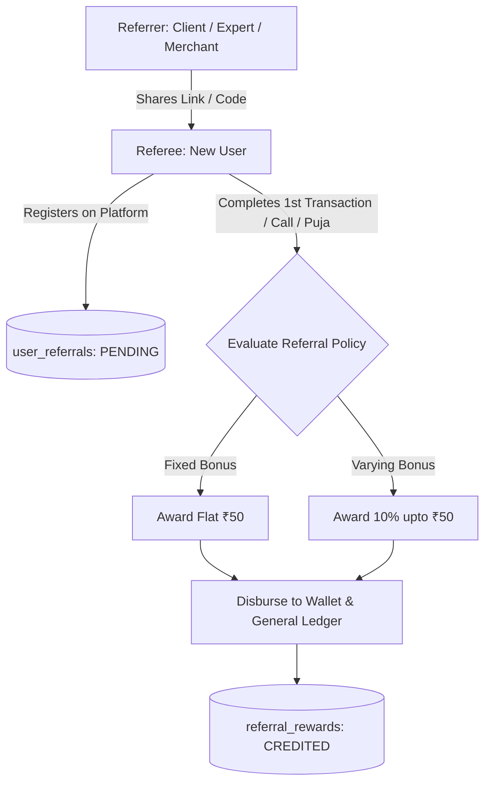
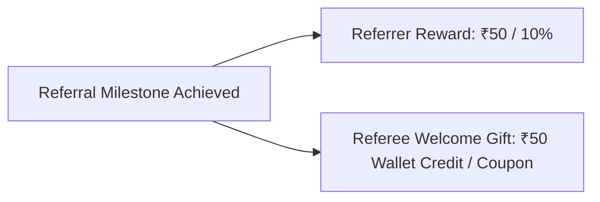
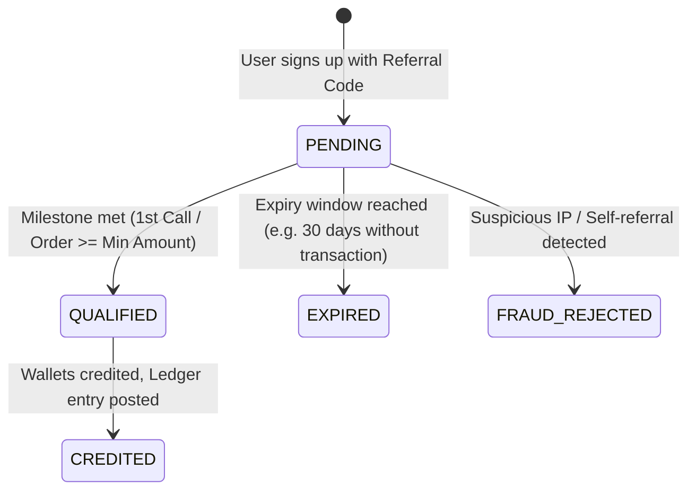
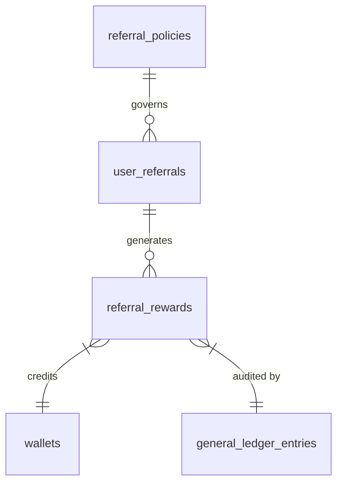
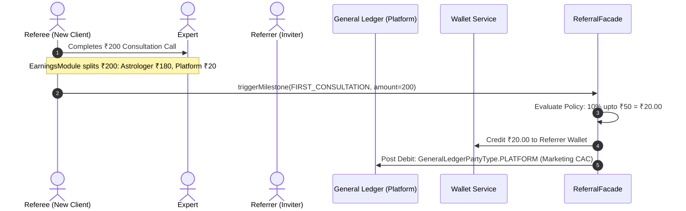

# Peer-to-Peer Referral System Design & Architecture

## 1. Executive Summary & Overview

The **Referral Subsystem** (`src/modules/finance/referrals/`) is the growth and organic customer acquisition engine for **Astrology in Bharat**. It provides a flexible, rule-driven incentive framework for peer-to-peer invitations between regular ecosystem participants (**Clients**, **Experts**, and **Merchants**).

Unlike transaction-fee splitting, referral bonuses are funded by the **Platform Customer Acquisition (Marketing) Budget** as one-time or milestone-based rewards, credited directly to user wallets upon reaching verified lifecycle milestones.



> [!IMPORTANT]
> **Explicit Exclusion of Agents**:
> Users with `RoleEnum.AGENT` are professional marketers governed exclusively by the **Unified Earnings Module** (`src/modules/finance/earnings/`). They earn ongoing revenue share per transaction and are strictly **excluded** from the peer-to-peer referral bounty program.

---

## 2. Participant Matrix & Roles

Any non-agent participant can refer another non-agent participant. Each pair can have its own customized reward rule:

| Referrer Role | Referee Role | Common Use Case | Typical Reward Trigger |
| :--- | :--- | :--- | :--- |
| **`CLIENT`** | **`CLIENT`** | Friend invites friend for astrology consultations | Referee completes 1st consultation or recharge |
| **`EXPERT`** | **`CLIENT`** | Astrologer brings their private followers to the app | Referee completes 1st consultation |
| **`EXPERT`** | **`EXPERT`** | Astrologer refers a peer astrologer to the platform | Referee completes KYC and 1st consultation |
| **`MERCHANT`** | **`MERCHANT`** | Vendor brings peer Puja Samagri seller | Referee lists items and fulfills 1st order |

---

## 3. Reward Calculation Types

The system supports two core calculation models configured per policy:

### 3.1 Model 1: Fixed Bonus (Guaranteed Flat Reward)
A predefined flat rupee amount credited when the qualification criteria are met.

* **Configuration**:
  - `reward_type`: `FIXED`
  - `reward_value`: `50.00` (₹50 flat)
  - `min_transaction_amount`: `100.00`
* **Calculation Walkthrough**:
  - Referee completes a ₹150 consultation call.
  - Requirement: ₹150 $\ge$ ₹100 threshold $\rightarrow$ **Qualified**.
  - Referrer receives: **₹50.00** flat credit.

---

### 3.2 Model 2: Varying Bonus (Percentage with Cap)
A dynamic percentage of the referee's initial transaction, capped to control maximum customer acquisition cost.

* **Configuration**:
  - `reward_type`: `PERCENTAGE`
  - `reward_value`: `10.00` (10%)
  - `max_cap`: `50.00` (₹50 maximum payout)
  - `min_transaction_amount`: `50.00`
* **Calculation Walkthroughs**:
  - **Scenario A (Under Cap)**:
    - Referee's 1st order amount: ₹200.00
    - Raw Calculation: $200.00 \times 10\% = ₹20.00$
    - Reward Credited: **₹20.00**
  - **Scenario B (Hits Cap)**:
    - Referee's 1st order amount: ₹800.00
    - Raw Calculation: $800.00 \times 10\% = ₹80.00$
    - Since ₹80.00 > ₹50.00 Cap $\rightarrow$ Reward Credited: **₹50.00**

---

### 3.3 Dual-Benefit / Two-Sided Rewards
Policies can simultaneously define rewards for both parties to encourage viral adoption:



1. **Referrer Bonus**: Disbursed upon milestone completion (e.g., ₹50 wallet credit).
2. **Referee Welcome Bonus**: Instantly credited upon signup or unlocked after their first recharge.

---

## 4. Lifecycle Milestones & Trigger Events

Referral qualification is evaluated against explicit business milestones to prevent fraud:



| Milestone Enum | Description | Typical Beneficiary |
| :--- | :--- | :--- |
| `SIGNUP` | Referee creates and verifies their account | Referee (Welcome bonus) |
| `FIRST_RECHARGE` | Referee adds wallet funds for the first time | Referrer + Referee |
| `FIRST_CONSULTATION` | Referee finishes their first Call/Chat with an Expert | Referrer |
| `FIRST_PRODUCT_ORDER`| Referee completes delivery of first E-commerce order | Referrer |
| `FIRST_PUJA_ORDER` | Referee completes their first Puja ceremony booking | Referrer |
| `EXPERT_VERIFIED` | Referee (Astrologer) completes KYC and is verified by Admin | Referrer (Peer Expert) |

---

## 5. Database Schema & Data Model

The referral subsystem lives in the `finance` schema and comprises three core entities:



### 5.1 `finance.referral_policies`
Stores the active referral reward configurations.

| Column | Type | Nullable | Description |
| :--- | :--- | :--- | :--- |
| `id` | `INT (PK)` | No | Auto-increment ID |
| `name` | `VARCHAR(150)` | No | E.g. "Client-to-Client 10% First Order Bounty" |
| `referrer_role` | `ENUM` | No | `CLIENT`, `EXPERT`, `MERCHANT`, `ALL` |
| `referee_role` | `ENUM` | No | `CLIENT`, `EXPERT`, `MERCHANT`, `ALL` |
| `reward_type` | `ENUM` | No | `FIXED`, `PERCENTAGE` |
| `reward_value` | `DECIMAL(10,2)` | No | Flat amount (e.g. 50.00) or percentage (e.g. 10.00) |
| `max_cap` | `DECIMAL(10,2)` | Yes | Maximum limit for percentage rewards |
| `min_transaction_amount` | `DECIMAL(10,2)` | No | Minimum qualifying transaction (default: 0.00) |
| `trigger_milestone` | `ENUM` | No | `SIGNUP`, `FIRST_RECHARGE`, `FIRST_CONSULTATION`, etc. |
| `referee_reward_amount` | `DECIMAL(10,2)` | No | Welcome bonus for the referee (default: 0.00) |
| `validity_days` | `INT` | No | Days referee has to qualify (default: 30 days) |
| `is_active` | `BOOLEAN` | No | Active toggle |
| `effective_from` | `TIMESTAMPTZ` | No | Start date |
| `effective_to` | `TIMESTAMPTZ` | Yes | Expiration date |

---

### 5.2 `finance.user_referrals`
Tracks the invitation relationship between two specific users.

| Column | Type | Nullable | Description |
| :--- | :--- | :--- | :--- |
| `id` | `UUID (PK)` | No | Unique tracking ID |
| `referrer_user_id` | `INT` | No | FK referencing `users.id` (Who invited) |
| `referee_user_id` | `INT` | No | FK referencing `users.id` (Who was invited) |
| `referral_code_used`| `VARCHAR(50)` | No | Code used at signup |
| `policy_id` | `INT` | Yes | Matched policy ID |
| `status` | `ENUM` | No | `PENDING`, `QUALIFIED`, `REWARDED`, `EXPIRED`, `REJECTED` |
| `qualified_at` | `TIMESTAMPTZ` | Yes | Timestamp when qualifying transaction occurred |
| `expires_at` | `TIMESTAMPTZ` | No | Expiration timestamp |
| `created_at` | `TIMESTAMPTZ` | No | Signup date |

---

### 5.3 `finance.referral_rewards`
Immutable ledger of all disbursed referral bonuses.

| Column | Type | Nullable | Description |
| :--- | :--- | :--- | :--- |
| `id` | `UUID (PK)` | No | Primary Key |
| `user_referral_id` | `UUID` | No | FK referencing `finance.user_referrals.id` |
| `beneficiary_user_id`| `INT` | No | User receiving the reward |
| `beneficiary_type` | `ENUM` | No | `REFERRER`, `REFEREE` |
| `reward_type` | `ENUM` | No | `FIXED`, `PERCENTAGE` |
| `amount` | `DECIMAL(10,2)` | No | Final amount credited (e.g. ₹50.00) |
| `reference_event_id`| `VARCHAR(120)` | Yes | `call_123`, `order_456`, `recharge_789` |
| `reference_event_type`| `VARCHAR(50)` | Yes | `CALL`, `ORDER`, `RECHARGE` |
| `wallet_transaction_id`| `UUID` | Yes | FK referencing `finance.wallet_transactions.id` |
| `created_at` | `TIMESTAMPTZ` | No | Disbursement timestamp |

---

## 6. Financial & Accounting Flow

Referral rewards are platform incentives. They are **never deducted from the astrologer or merchant's earnings**:



- **General Ledger Entry**:
  - `entry_type`: `DEBIT`
  - `party_type`: `PLATFORM`
  - `amount`: `₹20.00` (or `₹50.00`)
  - `note`: `referral_bounty for user #referee_id (milestone: FIRST_CONSULTATION)`

---

## 7. Anti-Fraud & Security Rules

1. **Strict Agent Exclusion**:
   ```typescript
   if (referrer.role === RoleEnum.AGENT || referee.role === RoleEnum.AGENT) {
     // Agents are exclusively handled by Unified Earnings Module
     return;
   }
   ```
2. **Self-Referral Prevention**:
   - Referrer ID and Referee ID cannot be identical (`referrer_user_id !== referee_user_id`).
   - Duplicate phone numbers, email aliases, or identical device IDs are flagged and set to `FRAUD_REJECTED`.
3. **One-Time Qualification**:
   - Once a referral moves to `REWARDED`, no further transactions from that referee can trigger referral bonuses.
4. **Minimum Spend & Expiry**:
   - Qualification requires genuine paid transactions meeting `min_transaction_amount` within `validity_days` (default 30 days).

---

## 8. Summary Comparison

```
┌──────────────────────────────────────────────────────────────┐
│                    ASTROLOGY IN BHARAT                       │
├──────────────────────────────┬───────────────────────────────┤
│    Unified Earnings Module   │    Referral Bounty Module     │
│ (`src/modules/finance/       │ (`src/modules/finance/        │
│   earnings/`)                │   referrals/`)                │
├──────────────────────────────┼───────────────────────────────┤
│ • Every transaction          │ • 1st transaction / milestone │
│ • Per-minute / Marketplace % │ • Fixed (₹50) or % (10% max50)│
│ • Paid from order gross      │ • Paid from Marketing Budget  │
│ • For Providers & Agents     │ • For Clients, Experts, Peers │
└──────────────────────────────┴───────────────────────────────┘
```
